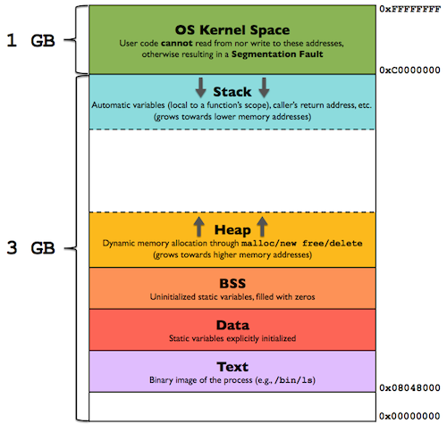

This tutorial is part one of a two part series that focuses on binary exploitation, in particular on x86 stack-based Windows buffer overflows. This part of the series focuses on the theory behind memory, processors and buffer overflows. We first take a look at some simple c programs and assembly, then dive into the different memory regions and how processes are executed. We then take a look at a vulnerable program in a debugger to see what a buffer overflow looks like. Finally, we discuss what memory protection mechanisms exist and how to use them to mitigate buffer overflows. 

## C Programming and Assembly
In order to make a computer conduct a specific task, a human must provide the exact instructions that must be executed. As humans aren't too comfortable writing computer instructions, we first write a program out in human readable code, after which we compile it into instructions that a computer can understand. 

As an example, the following _C_ code would print "Hello World!" to the screen:
```c
#include <stdio.h>

void main(void)
{
  puts("Hello World!");
}
```
For a computer to understand this, we must first compile it into assembly code in order for it to be executed by the computer. This is done by using _gcc_, which requires _C_ code as input, and translates the code into assembly so that gcc can output a binary file:
```bash
gcc hello_world.c -o hello_world
```
Binaries can be compiled into different architectures, and different processors can deal with different assembly code architectures. If we take a look at the compiled binary in Intel syntax, we can see the following assembly code:
```bash
objdump -D hello_world -M intel | less

0000000000001135 <main>:
    1135:       55                      push   rbp
    1136:       48 89 e5                mov    rbp,rsp
    1139:       48 8d 3d c4 0e 00 00    lea    rdi,[rip+0xec4]        # 2004 <_IO_stdin_used+0x4>
    1140:       e8 eb fe ff ff          call   1030 <puts@plt>
    1145:       90                      nop
    1146:       5d                      pop    rbp
    1147:       c3                      ret    
    1148:       0f 1f 84 00 00 00 00    nop    DWORD PTR [rax+rax*1+0x0]
    114f:       00 
```
Assembly is difficult to understand when you look into it for the first time. In the assembly above, we can see that the <em>main</em> function we wrote in _C_ code, calls _puts@plt_ (just like in our _C_ code), and then returns a value. 

Without knowing what the assembly code exactly does, we can already make an educated guess that it outputs something to the screen (given the puts call). When we execute the binary, we can see that we were right. 
```sh
./hello_world

> Hello World!
```
Before we dive into more "advanced" binaries and talk about what a buffer overflow is, how it's caused and how to exploit it, we should first examine a few basic concepts such as memory, the stack, CPU registers, pointers and how a process interacts within these concepts. 

When we launch an application, a process is created which gets allocated a certain amount of memory. This memory contains all information the process needs to execute, such as any dynamic link libraries (DLL's), shared objects (SO's) and the code itself. 

## Memory Overview
The image below shows how a process looks like in main memory. I will briefly discuss the different memory segments, but make sure to read Gabriele Tolomei's post on the subject [linked here](https://gabrieletolomei.wordpress.com/miscellanea/operating-systems/in-memory-layout/) to get a more elaborate understanding on the topic. 
<p>
	
</p>

*Image 1 - Memory Overview - [Source](https://gabrieletolomei.wordpress.com/miscellanea/operating-systems/in-memory-layout/)*

The **text** segment is the segment of the memory that contains the code and the instructions that are executed by the process. 

The **data** segment contains the global and static variables that are initialized by the programmer. 

The **BSS** segment, or block starting symbol, contains statically allocated variables that are declared but have not yet been assigned a value. 

The **heap** segment contains dynamically allocated memory, which is often used for instances where the required memory at run-time cannot statically be determined by the compiler prior to execution. The heap is managed by the malloc, calloc, realloc and free operations, and grows upwards to higher memory addresses. 

The **stack** segment contains the program stack, which is a section of memory that stores temporary data and is executed through a last-in-first-out (LIFO) structure, typically located in higher parts of memory. As opposed to the heap, the stack grows downwards to lower memory addresses. The set of values used by one function is called the stack frame. Whenever a value is added or removed from the stack, a stack pointer registers the "new" top of the stack, ensuring that the program is executing the correct instructions.

## Registers
When a processor wants to temporary store data from larger memory, it uses smaller registers to do so. Registers are quickly accessible, and allow for a quick program flow. 32-bit and 64-bit CPU architectures use different registers. In this section we will be taking a look at the available 32-bit registers and their purpose. 

| Register | Purpose |
| --- | --- |
| EAX | stores returned values from functions |
| EBX | scratch / temporary register |
| ECX | scratch / temporary register |
| EDX | scratch / temporary register |
| EDI | scratch / temporary register |
| ESI | scratch / temporary register |
| EBP | special register --> stores a pointer to the address of the base pointer |
| EIP | special register --> stores a pointer to the address of the instruction that is currently being executed |
| ESP | special register --> stores a pointer to the address of the top of the stack |

The _EAX_, _EBX_, _ECX_, _EDX_, _EDI_ and _ESI_ are general purpose registers, and are used to execute general CPU instructions and do not require further explanation. 

### Pointers
The _EBP_/_EIP_ and _ESP_ are special registers and have dedicated functionalities to ensure the program is executed succesfuly. 

The **extended instruction pointer (EIP)** stores the offset of the next instruction to be executed. After every instruction the EIP is moved to the next instruction. The EIP ensures that the program flow is running correctly.

The **extended stack pointer (ESP)** is the current stack pointer, which changes any time an address is added or removed onto/off the stack. ESP always points to the top of the stack. 

The **extended base pointer (EBP)** is the pointer to the top of the stack when the function is first called, thus it points to the base of the function. 

### Flags
Flags are used as a collection of bits representing Boolean values. Flags store the results of operatoins and the state of the processor. They are used to provide extra information regarding the address state of a register. In the table below you can find an overview with the most commonly used flags.  
| Flag | Description |
| --- | --- |
| CF - carry flag | set if the last arithmetic operation carried (addition) or borrowed (subtraction) a bit beyond the size of the register |
| PF - parity flag | set if the number of set bits in the least significant byte is a multiple of 2 |
| ZF - zero flag | set if the result of an operation is 0 |
| SF - sign flag | set if the result of an operation is negative |
| DF - direction flag | stream direction. If set, string operations will decrement their pointer rather than incrementing it, reading memory backwards |
| OF - overflow flag | set if signed arithmetic operations result in a value too large for the register to contain |

There are more flags than the one listed in the table above, but as they are not often used, I do not want to add extra confusion to this topic. 

### Words
Intel represents data sizes in terms of bytes and words. A WORD is 16 bits or 2 bytes of data. A DWORD (double WORD) is 32 bits or 2 bytes of data. A QWORD is 64 bits or 4 bytes of data. /bin

## Instructions
Machine instructions generally fall into three categories: data movement, arithmetic/logic, and control-flow. This section takes a look at a subset of the most used instructions within the three categories.

Whenever brackets \[\] are used, they are meant to dereference in order to deal with pointers. Dereferencing a pointer means to treat a pointer like the value it points to. 

### Data Movement
**mov** - move (Opcodes: 88, 89, 8A, 8B, 8C, 8E, ...)

The move instruction moves data from one register to another register. 
```text
mov eax, ebx
```
Which copies the value in EBX to EAX. 

**push** - push stack (Opcodes: FF, 89, 8A, 8B, 8C, 8E, ...)

The push instruction pushes a value onto the top of the stack.
```text
push eax
```
Pushes eax onto the stack.

**pop** - pop stack

The pop instruction removes (pops) a value off of the stack
```text
pop eax
```
Removes (pops off) eax from the stack. 

**lea** - load effective address

The lea instruction calculates the address of the second operand, and moves that adress to the first operand.
```text
lea edi, [ebx+4*esi]
```
The value of EBX + 4 \* ESI is moved into EDI. 

### Arithmetic / Logic
**add** - integer addition

The add instruction adds the contents of two operands together, and stores it in the first operand.
```text
add ebx, 10
```
The value of ebx is increased by 10.

**sub** - integer substraction

The sub intrusction substracts the contents of two operanderd together, and stores it in the first operand.
```text
sub ebx, 10
```
The value of ebx is decreased by 10.

**inc, dec** - increment, decrement

The inc instruction increments the contents of its operand by one. The dec instruction decrements the contents of its operand by one. 
```text
inc edi
dec edi
```
The value of EDI is first incremented by one, and then decremented by one. 

**imul** - integer multiplication

The imul instruction multiplies the two operands together, and stores the result in the first operand. When three operands are supplied, the second and third operands are multiplied and stores in the first operand. 
```text
imul eax, [var]

imul esi, edi, 25
```
The first line multiplies the value of EAX with the value of the memory location of VAR (as we are using dereferencing brackets), and store it in EAX. The second line multiplies the value of EDI with 25, and stores the result in ESI.

**and, or, xor** - bitwise logical and, or and exclusive or

The and, or and xor instructions execute the logical bitwise and, or and exclusive or operations on their operands, storing the results in the first operand. 
```text
xor edx, eax
```
The EDX register will be set equal to EDX ^ EAX. 

### Control-Flow
**jmp** - jump

The jump instruction jumps to the supplied address. It is used to redirect code or create loops and conditions. 
```text
jmp begin
jmp 0x602010
```
The first instruction is used to jump to the label "begin". The second instruction jumps to the memory address _0x602010_. The program continues executing the instructions after the jump. 

**jcondition** - conditional jump (je, jne, jz, jg, jge, jl, jle, ...)

There are several conditional jumps that can be used to add logic to the process. A few examples of this are jump when equal (je), jump when not equal (jne), jump when last result was zero (jz), jump when greater than (jg), jump when greater than or equal to (jge), jump when less than (jl) or jump when less than or equal to (jle). 
```text
cmp eax, ebx
jle done
```
If the contents of the EAX are less than or equal to the contents of EBX, jump to the label done. Otherwise continue with the next instruction. 

**cmp** - compare

The compare instruction compares the value of the first operand with the value of the second operand, and checks whether the result is less than zero, greather than zero or equal to zero. Depending on the result, a flag is set accordingly. 

**call, ret** - subroutine call and return

The call and return subroutine is similar to the jmp instruction. The difference between the two is that the call and ret routine pushes the values of EBP and EIP onto the stack, and then jump to whatever address is given. It then executes the function, and returns to pushed EBP and EIP values when it's done, so that it can continue the execution of the process exactly where it left off before executing the function. 

### Instructions Example
Now that we know a bit of theory regarding registers and instructions, let's take another look at the program we wrote earlier and try to understand it a bit better. 
```bash
objdump -D hello_world -M intel | less

0000000000001135 <main>:
    1135:       55                      push   rbp
    1136:       48 89 e5                mov    rbp,rsp
    1139:       48 8d 3d c4 0e 00 00    lea    rdi,[rip+0xec4]
    1140:       e8 eb fe ff ff          call   1030 <puts@plt>
    1145:       90                      nop
    1146:       5d                      pop    rbp
    1147:       c3                      ret    
    1148:       0f 1f 84 00 00 00 00    nop    DWORD PTR [rax+rax*1+0x0]
    114f:       00 
```
We can see that we first push rbp onto the stack. We then move the data of RSP to RBP. Next, we move the outcome of \[RIP + 0xec4\] to RDI, and call a function named puts@plt. We then see a NOP, which stands for no procedure, which does nothing. We then pop RBP off of the stack and move out of the puts@plt function by returning to the main process. 

## Stack-Based Buffer Overflow
 A buffer overflow (or buffer overrun) occurs when the volume of data exceeds the storage capacity of the memory buffer. As a result, the program attempting to write the data to the buffer overwrites adjacent memory locations. 

Now that we learnt the basics about memory and processors we can move on to what causes a buffer overflow. To do so, we will go through a very simple example, and only crash the program. In the next tutorial I will show you how to crash a system, control its memory and weaponize our attack to gain control over a server. 

Let's create a simple c program that uses the _gets_ function with a statically defined buffer to store a name. The input for the name that is stored is user controled. 
```c
#include <stdio.h>
#include <string.h>

int main(void)
{
  char buffer[12];

    printf("Enter your name: \n");
    gets(buffer);
    
    return 0;
}
```
Let's use gcc to compile the program and take a look at the output. 
```bash
gcc vulnerable_program.c -o vulnerable_program

vulnerable_program.c: In function ‘main’:
vulnerable_program.c:9:5: warning: implicit declaration of function ‘gets’; did you mean ‘fgets’? [-Wimplicit-function-declaration]
    9 |     gets(buffer);
      |     ^~~~
      |     fgets
/usr/bin/ld: /tmp/cctcPoTi.o: in function `main':
vulnerable_program.c:(.text+0x24): warning: the `gets' function is dangerous and should not be used.
```
Our compiler tells us that the "gets" function is dangerous, and that it should not be used. Instead it tells us we should use "fgets", which is the safer variant of gets. Let's take a look at the binary in objectdump to see what it's doing in Assembly.
```bash
objdump -D vulnerable_program -M intel | less

0000000000001149 <main>:
    1149:       55                      push   rbp
    114a:       48 89 e5                mov    rbp,rsp
    114d:       48 83 ec 10             sub    rsp,0x10
    1151:       48 8d 05 ac 0e 00 00    lea    rax,[rip+0xeac]
    1158:       48 89 c7                mov    rdi,rax
    115b:       e8 d0 fe ff ff          call   1030 <puts@plt>
    1160:       48 8d 45 f4             lea    rax,[rbp-0xc]
    1164:       48 89 c7                mov    rdi,rax
    1167:       b8 00 00 00 00          mov    eax,0x0
    116c:       e8 cf fe ff ff          call   1040 <gets@plt>
    1171:       b8 00 00 00 00          mov    eax,0x0
    1176:       c9                      leave  
    1177:       c3                      ret    
    1178:       0f 1f 84 00 00 00 00    nop    DWORD PTR [rax+rax*1+0x0]
    117f:       00
```
We can see the calls to the gets function which asks for user input and the puts function that outputs the provided information to the screen.  

Let's execute the program and supply our name to see what happens. 
```sh
chmod +x vulnerable_program.c

./vulnerable_program
Enter your name:
Ruben
```
When we supply "Ruben", the program exits and nothing bad happens. When we use gdb to look at what's happening, we can see that the program can handle our input and exit normally. The issue arises when we exceed the statically defined buffer of 12 characters. We supply 20 characters and see what happens.
```sh
python3 -c "print('A' * 20)"
AAAAAAAAAAAAAAAAAAAA

./vulnerable_program
Enter your name:
AAAAAAAAAAAAAAAAAAAA

zsh: bus error  ./vulnerable_program
```
We get an error, after which the program crashes. Nice, we triggered the buffer overflow. Let's take a look at the binary, and see what happens when we supply 20 "A" characters. For this we use gdb, set a breakpoint at main, take a look at the registers prior to supplying input, then add the 20 A's, examine the crash and look at the state of the program after the crash.
```sh
gdb vulnerable_program # launch vulnerable_program in gdb

(gdb) b main # sets a breakpoint at main
Breakpoint 1 at 0x114d

(gdb) run # run will run the current program
Starting program: /home/kali/Documents/bufferoverflow/vulnerable_program 

Breakpoint 1, 0x000055555555514d in main ()

(gdb) info registers # info registers shows us the info of the registers
rax            0x555555555149      93824992235849
rbx            0x555555555180      93824992235904
rcx            0x7ffff7fa6738      140737353770808
rdx            0x7fffffffdfa8      140737488347048
rsi            0x7fffffffdf98      140737488347032
rdi            0x1                 1
rbp            0x7fffffffdea0      0x7fffffffdea0
rsp            0x7fffffffdea0      0x7fffffffdea0

(gdb) n # we supply n to move to the next instruction
Single stepping until exit from function main,
which has no line number information.

Enter your name: 
AAAAAAAAAAAAAAAAAAAA

Program received signal SIGBUS, Bus error.
0x00007ffff7dff700 in check_stdfiles_vtables () at vtables.c:85
85      vtables.c: No such file or directory.
```
And we see the crash. If we now take a look at the registers, we can see that the RBP is set to 0x4141414141414141. 
```sh
(gdb) info registers
rax            0x0                 0
rbx            0x555555555180      93824992235904
rcx            0x7ffff7fa69a0      140737353771424
rdx            0x0                 0
rsi            0x5555555596b1      93824992253617
rdi            0x7ffff7fa9680      140737353782912
rbp            0x4141414141414141  0x4141414141414141
rsp            0x7fffffffdeb0      0x7fffffffdeb0
```
0x41 is hex for "A". Because we supplied too many characters in the buffer, the base pointer was overwritten, thus the program tries to return to 0x4141414141414141 after finishing its function. This address does not exist, and therefore the program does not know where to go next and crashes. 

We just went through a very basic bufferoverflow attack, which allowed us (as an attacker) to simply crash the program. The bufferoverflow in this example was not weaponized any further. In part two of this tutorial series I will go through the whole process of exploiting a buffer overflow vulnerability, and gain access over the server that is running the application in the process. 

## Protections
It wouldn't be a good tutorial if it doesn't end with recommendations as to how prevent a buffer overflow attack of occuring in the first place. First of all, it is important to not use vulnerable functions such as gets, and instead use the safe variant such as fget. We can also implement memory protection measures to protect our binaries such as ASLR, PIE and canaries. 

**Address space layout randomization** (ASLR) is a memory-protection process for operating systems that guards against buffer-overflow attacks by randomizing the location where system executables are loaded into memory.

**Data execution prevention** (DEP) or **no-execute** (NX) marks memory regions as non-executable, such that an attempt to execute machine code in these regions will cause an exception. 

**Relocation read-only** (RELRO) ensures that the linker resolves all dynamically linke dfunctions at the beginning of the execution, and then makes the global offset table (GOT) read only.  

**Position-independent executable** (PIE) are an output of the hardened package build process. A PIE binary and all of its dependencies are loaded into random locations within virtual memory each time the application is executed. 

**Stack canaries** can be used to detect if the return address was overwritten, and makes it more difficult to make a flow hijack. 

When the above protections are implemented, and safe syntax is used within the program, we can prevent most buffer overflow vulnerabilities. 

We can take a look at our binary, to see what protections are enabled using the _checksec_ program.
```sh
checksec vulnerable_program
[*] '/home/kali/Documents/bufferoverflow/vulnerable_program'
    Arch:     amd64-64-little
    RELRO:    Partial RELRO
    Stack:    No canary found
    NX:       NX enabled
    PIE:      No PIE (0x400000)
```
If we want to enable memory protection for our executable, we can compile the program with the following gcc command.
```sh
gcc vulnerable_program.c -o vulnerable_program_with_protections -fPIE -fstack-protector-all
```
When we now take a look at the protections of the binary, we can see that canary, nx and pie are enabled.
```sh
checksec vulnerable_program_with_protections
[*] '/home/kali/Documents/bufferoverflow/vulnerable_program_with_protections'
    Arch:     amd64-64-little
    RELRO:    Partial RELRO
    Stack:    Canary found
    NX:       NX enabled
    PIE:      PIE enabled
```
I hope this tutorial was useful for you. If you want to learn how to weaponize a bufferoverflow you should check out part two of this series. See you at the next one!